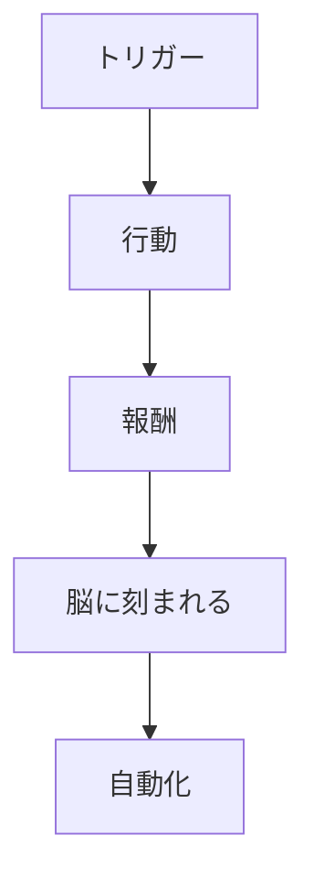
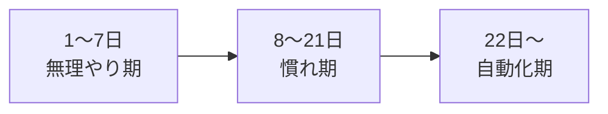
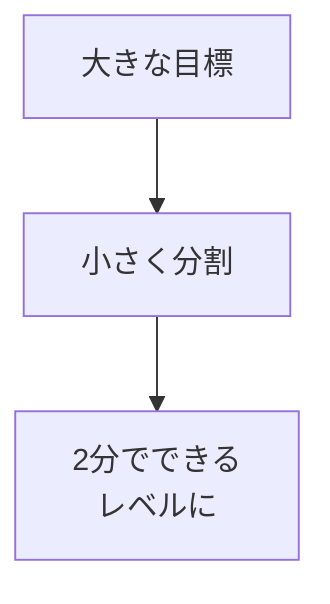
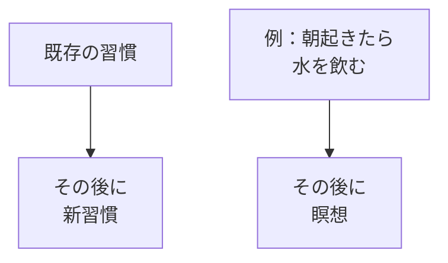
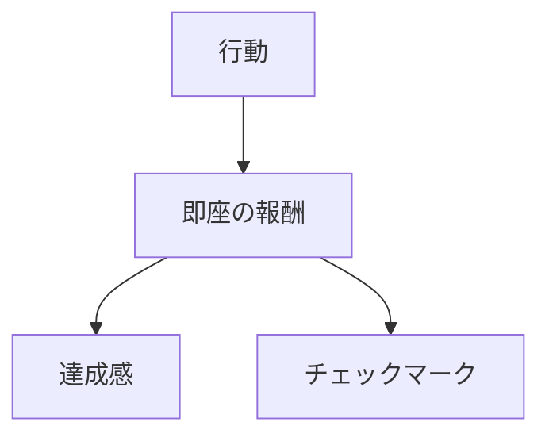

## はじめに

「新しいことを始めたい」

「でも続かない...」

習慣化に失敗するのは、
**意志力が足りないからではありません**。

**方法が間違っている**からです。

科学が明らかにした、
**確実に習慣を身につける方法**を
解説します。

---

## 習慣のメカニズム

### 脳の仕組み

**習慣は「ループ」**です。

### 習慣化の期間

**平均66日**で自動化されます。

---

## 習慣化のステップ

### 1. 小さく始める

### 2. トリガーを設定

### 3. 報酬を設定

---

## 実践できること

**① 「2分ルール」**

新しい習慣は
2分で終わるレベルから。

**② 既存習慣に連結**

「〜したら、次は〜」

**③ 見える化**

カレンダーにチェック。
連続記録を作る。

**④ 環境設計**

障害を減らし、
自動化する。

---

## まとめ

習慣化は、
**意志力ではなく、
仕組み**で行います。

小さく始めて、
トリガーを設定し、
報酬を与える。

それが、
確実に新しい自分を
作る方法です。

---

## セッションでできること

コーチングセッションでは、
あなたの習慣化計画を
一緒に立てます。

- 目標の適切な分割
- トリガーの設定
- 継続のサポート

**新しい習慣で、
新しい自分を作りましょう。**
