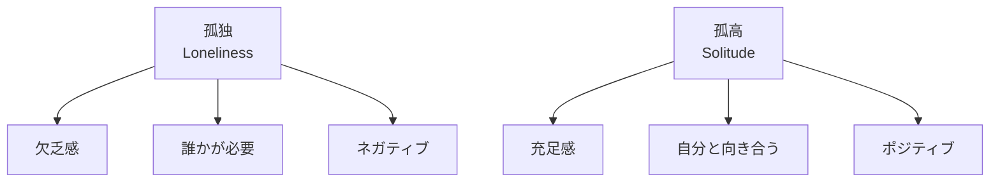
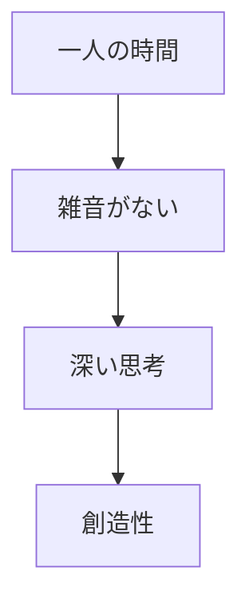
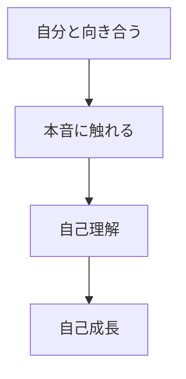

## はじめに

「一人は寂しい...」

「誰かといたい...」

でも、
**一人でいる時間は
「欠乏」ではなく、
「機会」**です。

孤独を恐れるのではなく、
**孤高を楽しむ**。

それが、
内なる豊かさへの道です。

哲学者のチョムスキーは、「独りでいる時間こそが、最も豊かな創造の時間だ」と言いました。私も、一人でカフェにいる時間が、実は最も創造的な時間になっています。

---

## 孤独と孤高の違い：2つの本質

### 定義

孤独は「誰かがいない」という欠乏感。孤高は「自分と向き合う」という充足感。同じ「一人」でも、内面の状態が全く異なります。

---

## 孤高の3つの価値

### 1. 創造性の源泉

多くの芸術家や発明家が、孤高の時間を大切にしています。アインシュタインも、一人で思索する時間こそが相対性理論の着想につながったと言っています。

### 2. 自己理解の深化

他人と一緒にいると、どうしても「演じる」部分が出てきます。一人の時間だからこそ、自分の本音に触れることができます。

### 3. 精神的な回復

常に他人と接していると、脳は「監視モード」を維持し続け、疲労が蓄積します。一人の時間は、その疲れを癒す貴重な機会です。

---

## 今日からできる4つの実践法

**① 「孤高の時間」を作る**

週に2時間、
完全に一人の時間を。

スマホはオフ。本やノートを持って、自分だけの時間を。

**② 無駄な付き合いを減らす**

義務感での付き合いを
断る練習。

「断ったら嫌われるかも」という恐怖を、少しずつ克服しましょう。

**③ ジャーナリングを始める**

一人の時間に、
自分と対話する。

「今、何を感じている？」「何が嬉しかった？」—問いかけるだけで変化が始まります。

**④ 一人で没頭できる趣味を見つける**

読書、散歩、料理、絵を描く...

一人でも全く寂しくない、没頭できる何かを見つけましょう。

---

## まとめ

孤独は避けられない、
**孤高は選べる**。

一人でいる時間を
**豊かに使う**ことで、
内面が充実します。

寂しさを恐れず、
孤高を楽しむ。

それが、
真の自立への道です。

一人でいることに罪悪感を感じる必要はありません。むしろ、それは自分を深く知るための贅沢な時間なのです。

---

## セッションでできること

コーチングセッションでは、
あなたの「孤高の時間」を
設計します。

- 一人時間の最適化
- 無駄な付き合いの整理
- 内面充実のための活動

**一人でいる時間を、
最高の時間に変えましょう。**
