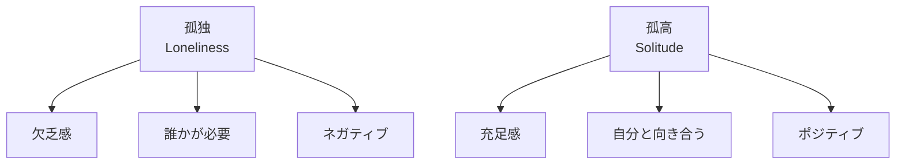
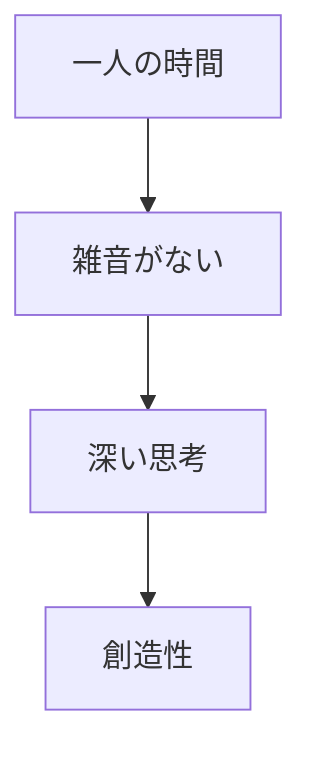
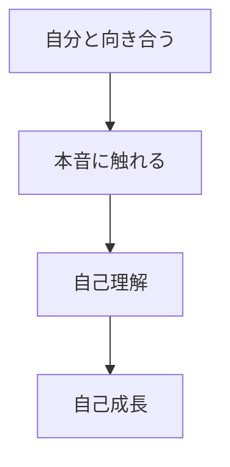

## はじめに

「一人は寂しい...」

「誰かといたい...」

でも、
**一人でいる時間は
「欠乏」ではなく、
「機会」**です。

孤独を恐れるのではなく、
**孤高を楽しむ**。

それが、
内なる豊かさへの道です。

---

## 孤独と孤高の違い

### 定義

---

## 孤高の価値

### 創造性

### 自己理解

---

## 実践できること

**① 「孤高の時間」を作る**

週に2時間、
完全に一人の時間を。

**② 無駄な付き合いを減らす**

義務感での付き合いを
断る練習。

**③ ジャーナリング**

一人の時間に、
自分と対話する。

**④ 趣味を楽しむ**

一人で没頭できる
何かを見つける。

---

## まとめ

孤独は避けられない、
**孤高は選べる**。

一人でいる時間を
**豊かに使う**ことで、
内面が充実します。

寂しさを恐れず、
孤高を楽しむ。

それが、
真の自立への道です。

---

## セッションでできること

コーチングセッションでは、
あなたの「孤高の時間」を
設計します。

- 一人時間の最適化
- 無駄な付き合いの整理
- 内面充実のための活動

**一人でいる時間を、
最高の時間に変えましょう。**
