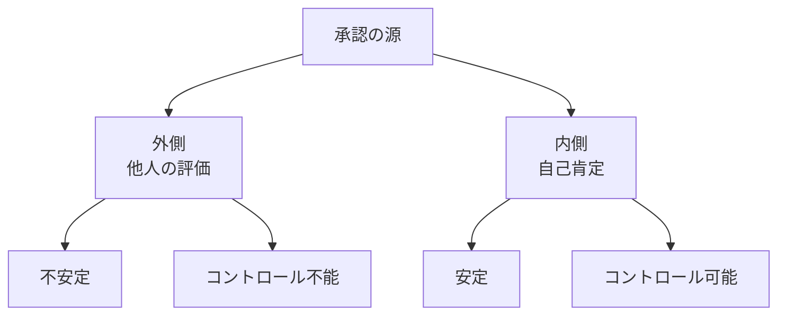
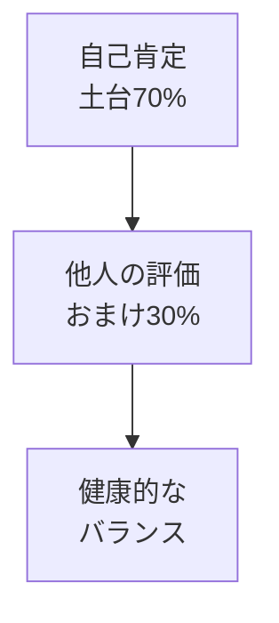
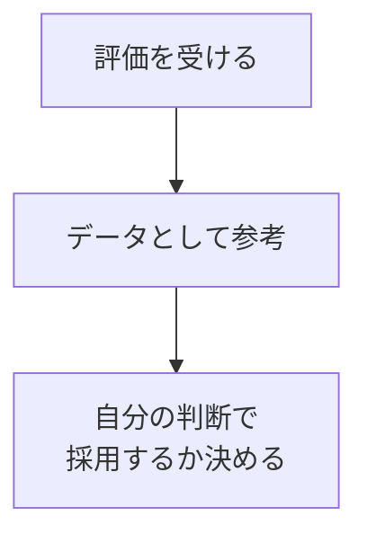

## はじめに

「どう思われているか気になる...」

「いいね！が欲しい...」

承認欲求は、
人間の根本的な欲求です。

でも、
**他人の評価に左右されると、
自分を失います**。

健康的な付き合い方を
見つけましょう。

---

## 承認欲求の構造

### 外側 vs 内側

---

## バランスの取り方

### 内側を土台に

### 他人の評価を「データ」に

---

## 実践できること

**① 「自分基準」を作る**

「私は〇〇を
大切にする人」
を明確に。

**② 承認を「おまけ」と考える**

あれば嬉しい、
なくても大丈夫。

**③ 内側の充足感を育てる**

達成感、
成長の感覚、
貢献感...

**④ 無関心を許容する**

全員に好かれる
必要はない。

---

## まとめ

承認欲求は
消せませんが、
**バランスは取れます**。

内側からの充実感を土台に、
他人の評価はおまけ。

それが、
安定した自己価値への道です。

---

## セッションでできること

コーチングセッションでは、
あなたの承認欲求パターンを
分析し、
内側の充足感を育てます。

- 自己肯定感の構築
- 承認欲求のバランス調整
- 内面充実のための活動

**自分の価値は、
自分が決めましょう。**

[→ 体験セッションの詳細を見る](/sessions)
