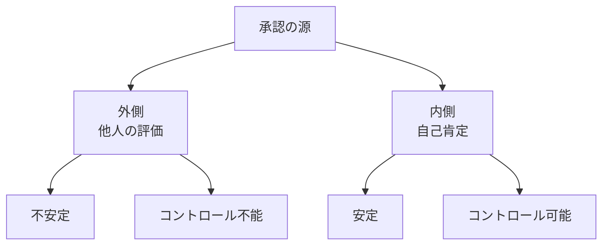
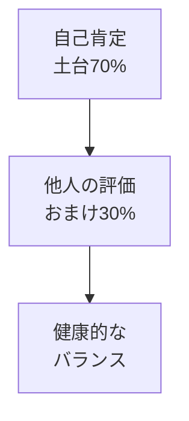
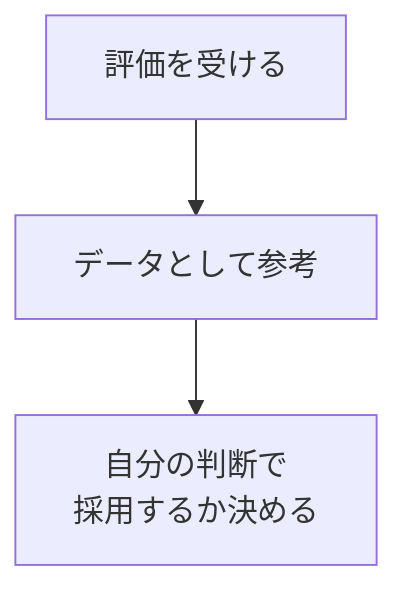

## はじめに

「どう思われているか気になる...」

「いいね！が欲しい...」

承認欲求は、
人間の根本的な欲求です。

でも、
**他人の評価に左右されると、
自分を失います**。

健康的な付き合い方を
見つけましょう。

私も、かつてはSNSのいいねの数でその日の機嫌が決まっていました。でも、それでは心は常に不安定でした。変化のきっかけは、ある友人から「君は自分の価値を、他人に委ねすぎてるよ」と言われたことでした。

---

## 承認欲求の構造：2つの源

### 外側 vs 内側

外側の承認は、天気のように変わります。今日は褒められても、明日は無視されるかもしれません。一方、内側の承認は、自分でコントロールできます。

---

## バランスの取り方：3つのステップ

### 1. 内側を土台にする

他人の評価をゼロにする必要はありません。ただ、主役と脇役のバランスを変えましょう。内側の自己肯定が主役（70%）、他人の評価は脇役（30%）です。

### 2. 他人の評価を「データ」に変える

「あなたは〇〇だ」と言われたら、それは一つのデータに過ぎません。「これは私に当てはまるか？」と自分で判断しましょう。

### 3. 「自分基準」を確立する

「私は〇〇を大切にする人」という独自の価値観を持つことで、他人の評価に振り回されなくなります。

---

## 今日からできる4つの実践法

**① 「自分基準」を作る**

「私は〇〇を
大切にする人」
を明確に。

「誠実さ」「創造性」「親しみやすさ」—自分の中の軸を見つけましょう。

**② 承認を「おまけ」と考える**

あれば嬉しい、
なくても大丈夫。

「いいね」がついたらラッキー、なくても自分の価値は変わらない。

**③ 内側の充足感を育てる**

達成感、
成長の感覚、
貢献感...

「今日は良い仕事ができた」「誰かの役に立てた」—その実感が、何よりの承認になります。

**④ 無関心を許容する**

全員に好かれる
必要はない。

実際、世界で最も尊敬される人たちでも、批判されることはあります。「全員に好かれる」という目標自体が、不可能なのです。

---

## まとめ

承認欲求は
消せませんが、
**バランスは取れます**。

内側からの充実感を土台に、
他人の評価はおまけ。

それが、
安定した自己価値への道です。

他人の評価を恐れる必要はありません。ただ、それが自分の全てではないことを知っていれば、自由になれます。

---

## セッションでできること

コーチングセッションでは、
あなたの承認欲求パターンを
分析し、
内側の充足感を育てます。

- 自己肯定感の構築
- 承認欲求のバランス調整
- 内面充実のための活動

**自分の価値は、
自分が決めましょう。**
