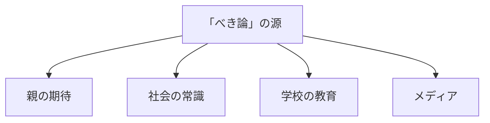
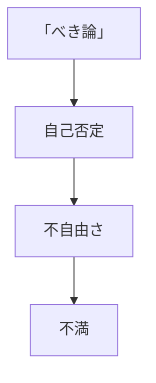
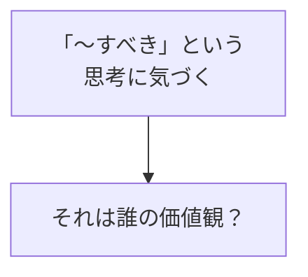
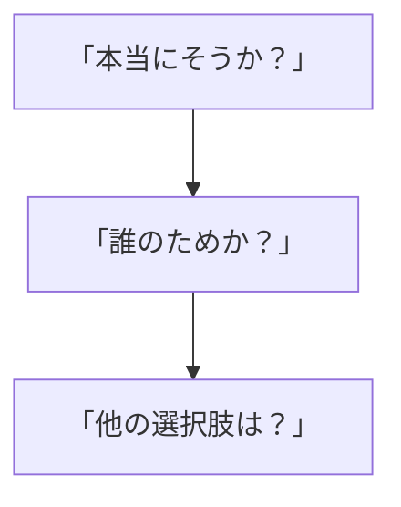
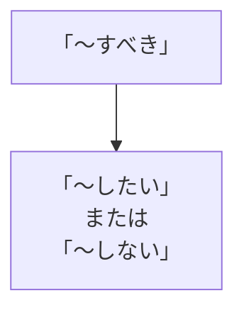

## はじめに

「〜すべきだ」

「〜しなければならない」

私たちは、
無意識に「べき論」に
縛られています。

「男は強くあるべき」
「女は優しくあるべき」
「大人は我慢すべき」

でも、これらは
**誰かの価値観**です。

あなたの価値観では
ないかもしれません。

あるクライアントは、「30歳までに結婚すべき」という思い込みに囚われ、焦りから無理な交際を続けていました。でも、その「べき」は祖母の言葉であり、本人の価値観ではありませんでした。

---

## 「べき論」の正体：4つの源

### どこから来たか

私たちの脳は、幼少期に「世の中のルール」を吸収するようにできています。それが、大人になっても自動的に動作し続けるのです。

### 影響

「〜すべき」なのにできない自分を責め、苦しむ。それが「べき論」の罠です。

---

## 書き換えの3ステッププロセス

### 1. 意識する

自分の思考の中に「〜すべき」「〜しなければならない」がないか、意識的にチェックしましょう。

### 2. 問い直す

「本当にそれは正しいのか？」「それをやるのは誰のためか？」「他に選択肢はないのか？」—3つの問いで、「べき」の正体が見えてきます。

### 3. 書き換える

「〜すべき」は、「〜したい」「〜したくない」「〜してもいい」に書き換えられます。選択の自由を取り戻すのです。

---

## 今日からできる4つの実践法

**① 「べき」リストを作る**

自分が思う
「〜すべき」を
全て書き出す。

「就職すべき」「結婚すべき」「子供を持つべき」—思いつく限り書き出しましょう。

**② 出典を確認する**

それは誰の価値観？

親？先生？会社？それとも、本当に自分？

**③ 「したい」に変える**

「〜すべき」→
「〜したい」

「仕事で成功すべき」→「仕事で成功したい」。一文字変わるだけで、圧迫感が自由に変わります。

**④ 自分の憲法を作る**

「私は〇〇を
大切にする」

自分独自の価値観を言語化することで、誰かの「べき」に振り回されなくなります。

---

## まとめ

「べき論」は、
**誰かが作った枠**です。

それを疑い、
自分の価値観で
書き換える。

それが、
真の自由への道です。

「〜すべき」が頭をよぎったら、一度立ち止まってみてください。それは、本当にあなたの声なのか、それとも誰かの声なのか。

---

## セッションでできること

コーチングセッションでは、
あなたの「べき論」を
一緒に見直し、
書き換えます。

- 「べき論」の特定
- 価値観の再定義
- 自己憲法の作成

**自分の人生のルールは、
自分で決めましょう。**
