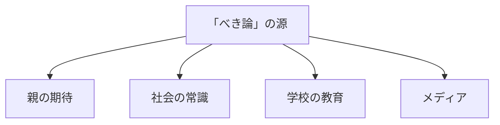
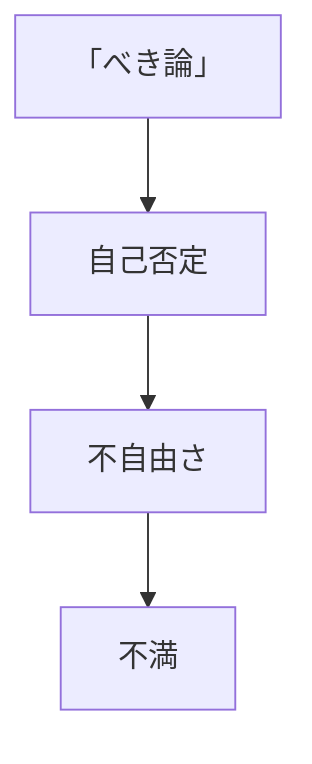
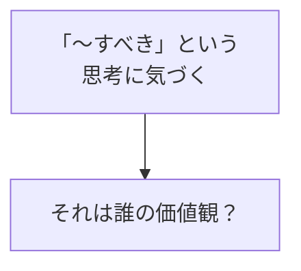
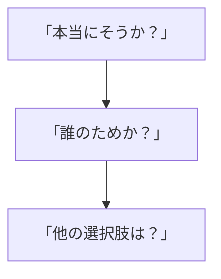
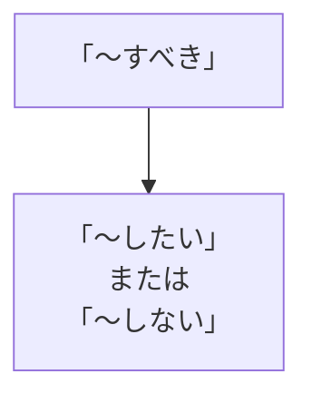

## はじめに

「〜すべきだ」

「〜しなければならない」

私たちは、
無意識に「べき論」に
縛られています。

「男は強くあるべき」
「女は優しくあるべき」
「大人は我慢すべき」

でも、これらは
**誰かの価値観**です。

あなたの価値観では
ないかもしれません。

---

## 「べき論」の正体

### どこから来たか

### 影響

---

## 書き換えのプロセス

### 1. 意識する

### 2. 問い直す

### 3. 書き換える

---

## 実践できること

**① 「べき」リストを作る**

自分が思う
「〜すべき」を
全て書き出す。

**② 出典を確認する**

それは誰の価値観？

**③ 「したい」に変える**

「〜すべき」→
「〜したい」

**④ 自分の憲法を作る**

「私は〇〇を
大切にする」

---

## まとめ

「べき論」は、
**誰かが作った枠**です。

それを疑い、
自分の価値観で
書き換える。

それが、
真の自由への道です。

---

## セッションでできること

コーチングセッションでは、
あなたの「べき論」を
一緒に見直し、
書き換えます。

- 「べき論」の特定
- 価値観の再定義
- 自己憲法の作成

**自分の人生のルールは、
自分で決めましょう。**
