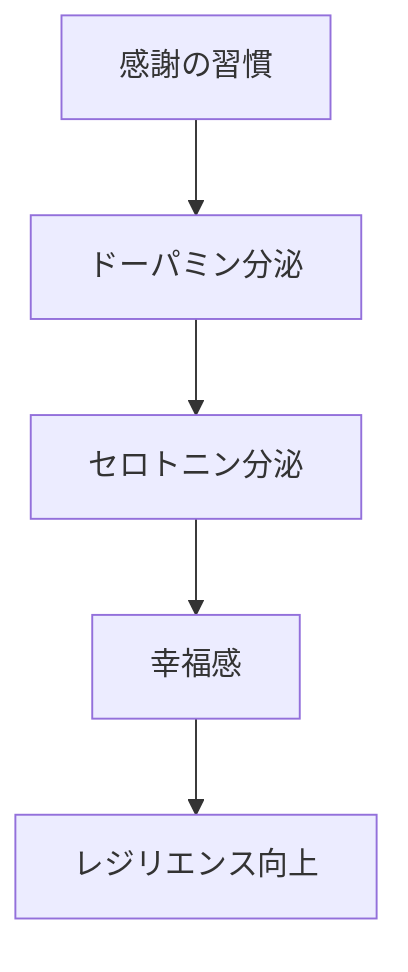
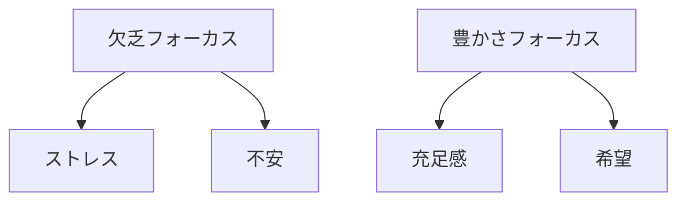
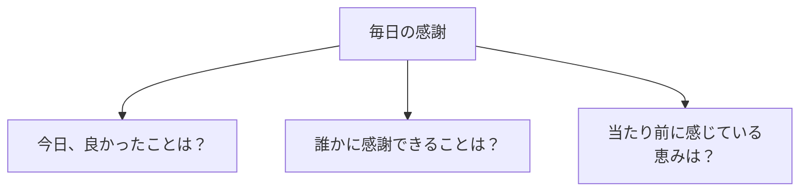
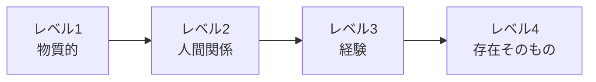

## はじめに

「もっと欲しい...」

「足りない...」

私たちの脳は、
**欠乏にフォーカス**するように
できています。

でも、感謝の習慣は、
そのフォーカスを
**「豊かさ」に変えます**。

それが、
レジリエンス（回復力）の
秘密です。

実は、感謝の習慣を始めてから、私自身が驚くほど変わりました。小さなことに喜べるようになり、逆境でも「この中で感謝できることは何か」を見つけられるようになったのです。

---

## 感謝の科学：脳に何が起きるか

### 脳への影響

カリフォルニア大学の研究によると、感謝を書き出すだけで、脳の前頭前野が活性化し、ストレスホルモンが低下します。これは、薬物によらない自然の抗うつ効果です。

### フォーカスの変化

「足りない」に目を向けると、脳は常に「脅威」を探します。「あるもの」に目を向けると、脳は「機会」を見つけます。

---

## 感謝の実践：4つのレベル

### 3つの質問

### 感謝のレベル

レベル1は「食べ物」「住む場所」、レベル2は「家族」「友人」、レベル3は「今日の経験」、レベル4は「生きていること自体」。深く掘れば掘るほど、感謝の質が変わります。

---

## 今日からできる4つの実践法

**① 感謝日記をつける**

毎晩3つの感謝を書く。

たった3行でも、継続することで脳の配線が変わります。書くことが大切です。

**② 感謝の手紙を書く**

感謝している人に、
具体的に伝える。

手紙を書くだけでも効果があります。届けると、効果は倍加します。

**③ 朝の感謝を習慣化する**

目覚めた瞬間、
感謝することを思い浮かべる。

「今日も目が覚めた」「新しい一日が始まる」—この単純な習慣が一日を変えます。

**④ 困難の中の感謝を見つける**

逆境でも、
小さな光を見つける。

失業した時でも「この時間がある」「新しい可能性がある」と見つけられれば、回復力が生まれます。

---

## まとめ

感謝は、
**「持っているもの」に
目を向ける力**です。

それが、
レジリエンスを高め、
逆境を乗り越える
力をくれます。

今日も、
感謝を習慣に。

感謝は、不幸を否定するのではなく、不幸の中でも光を見つける力です。

---

## セッションでできること

コーチングセッションでは、
感謝の習慣を
一緒に作り上げます。

- 感謝のパターン分析
- 感謝日記の習慣化
- レジリエンス強化

**感謝で、
心を豊かにしましょう。**
