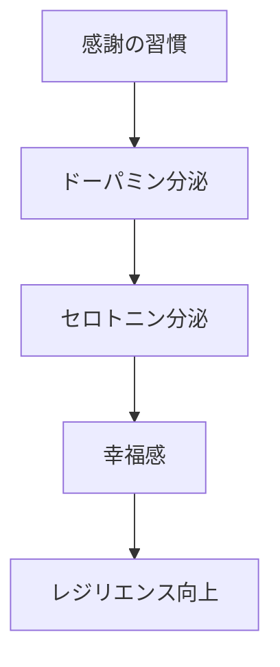
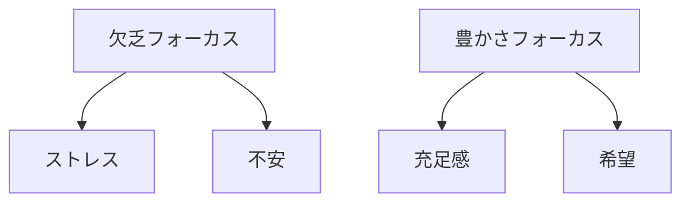
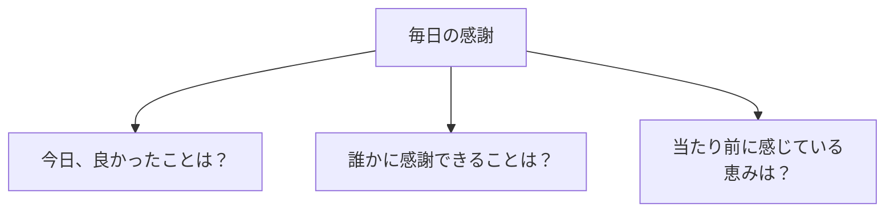
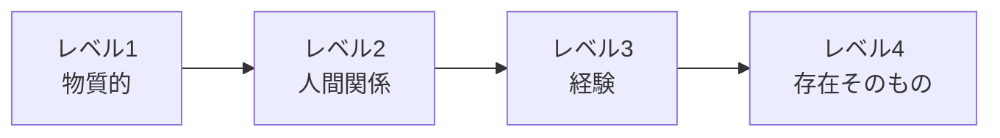

## はじめに

「もっと欲しい...」

「足りない...」

私たちの脳は、
**欠乏にフォーカス**するように
できています。

でも、感謝の習慣は、
そのフォーカスを
**「豊かさ」に変えます**。

それが、
レジリエンス（回復力）の
秘密です。

---

## 感謝の科学

### 脳への影響

### フォーカスの変化

---

## 感謝の実践

### 3つの質問

### 感謝のレベル

---

## 実践できること

**① 感謝日記**

毎晩3つの感謝を書く。

**② 感謝の手紙**

感謝している人に、
具体的に伝える。

**③ 朝の感謝**

目覚めた瞬間、
感謝することを思い浮かべる。

**④ 困難の中の感謝**

逆境でも、
小さな光を見つける。

---

## まとめ

感謝は、
**「持っているもの」に
目を向ける力**です。

それが、
レジリエンスを高め、
逆境を乗り越える
力をくれます。

今日も、
感謝を習慣に。

---

## セッションでできること

コーチングセッションでは、
感謝の習慣を
一緒に作り上げます。

- 感謝のパターン分析
- 感謝日記の習慣化
- レジリエンス強化

**感謝で、
心を豊かにしましょう。**
