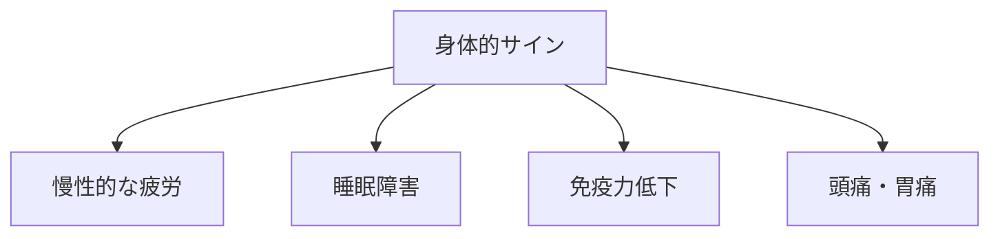
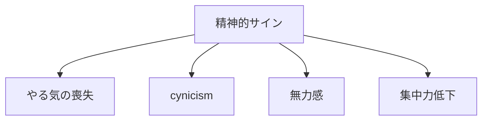
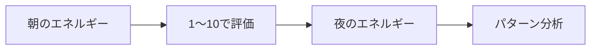
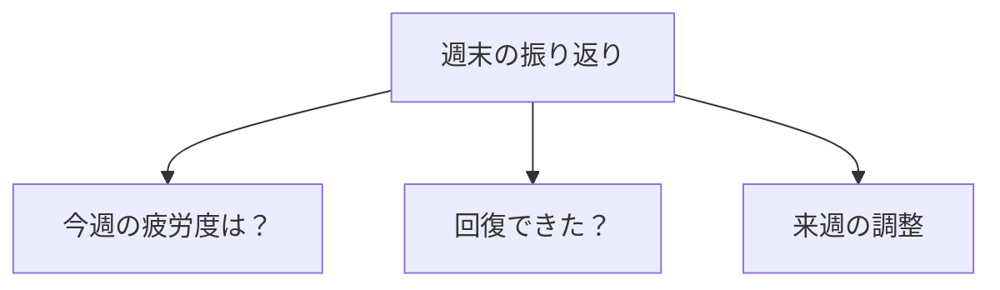

## はじめに

「もう少し頑張れる...」

「休んでる暇はない...」

そう思って、
限界を超えて
働いていませんか？

バーンアウトは、
**突然やってきません**。

**無視したサインの
積み重ね**です。

自分のキャパシティを知り、
適切にブレーキをかける。

それが、
長期的なパフォーマンスへの
鍵です。

---

## バーンアウトのサイン

### 身体的サイン

### 精神的サイン

---

## キャパシティの測り方

### エネルギー・チェック

### 週次レビュー

---

## 実践できること

**① エネルギー・ログ**

1日3回、
エネルギーレベルを記録。

**② 「黄色信号」に注目**

イライラ、
集中力低下、
眠気...

**③ 週に1回「回復日」**

完全に仕事を離れる日を作る。

**④ 「ノー」と言う練習**

キャパシティを超える
依頼は断る。

---

## まとめ

キャパシティを知ることは、
**「弱さ」ではなく「賢さ」**です。

限界を超える前に
ブレーキをかける。

それが、
長期的な活躍への
道です。

---

## セッションでできること

コーチングセッションでは、
あなたのキャパシティを
分析し、
適切なペース配分を
設計します。

- バーンアウトサインの特定
- エネルギー管理
- 回復計画の作成

**限界を知り、
長く輝き続けましょう。**
