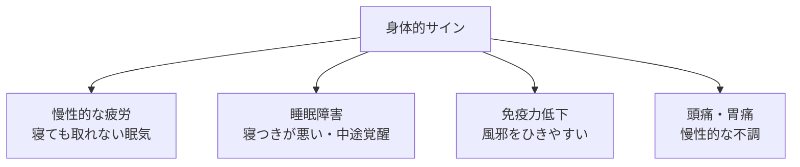
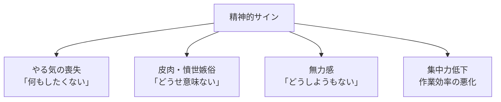
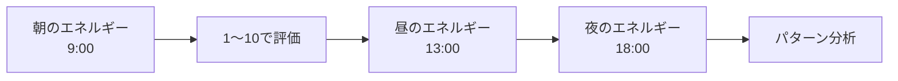
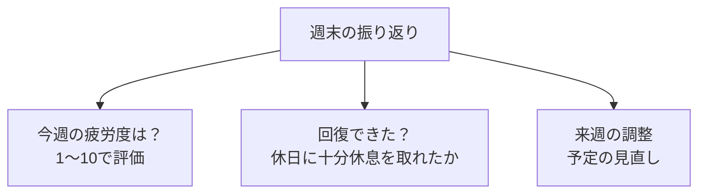

## はじめに

「もう少し頑張れる...」

「休んでる暇はない...」

そう思って、限界を超えて働いていませんか？

実は、バーンアウトは**突然やってきません**。無視し続けたサインの積み重ねなんです。

自分のキャパシティ（許容量）を正しく知り、適切なタイミングでブレーキをかける。それが、長期的に高いパフォーマンスを維持する鍵となります。

---

## バーンアウトがもたらす3つの警告サイン

バーンアウトは身体と心から、段階的に警告を発しています。これらのサインを見逃さないことが大切です。

### 身体的サイン：身体が発するSOS

30代の会社員Sさんは、半年間毎日残業して「ちょっと疲れてるだけ」と思っていました。しかし、風邪をひきっぱなしになり、最終的に2週間の休職を余儀なくされました。身体の声を無視した結果です。

### 精神的サイン：心の燃え尽き信号

起業家のTさんは、最初は「仕事が楽しくて仕方ない」と語っていました。しかし、2年後には「朝、目が覚めるのが怖い」と言うようになりました。これが精神的バーンアウトの典型的な例です。

---

## キャパシティを正確に測る2つの方法

自分のキャパシティを数値化することで、客観的に状態を把握できます。

### エネルギー・チェック：1日3回のセルフモニタリング

著名な精神科医である樺沢紫苑先生も推奨する方法です。1週間続けるだけで、「自分は月曜日の午後に弱い」「金曜日の朝は調子がいい」といったパターンが見えてきます。

### 週次レビュー：週末の振り返り習慣

マイクロソフトのCEO、サティア・ナデラも週末に「メンタルチェックイン」を行っていると言います。週に一度、自分と向き合う時間を設けることで、長期的な持続可能性を確保できます。

---

## 今日から始められる4つの実践方法

### ① エネルギー・ログをつける

1日3回、エネルギーレベルを1〜10で記録します。スマートフォンのメモ帳や日記アプリで十分。1週間で自分のパターンが見えてきます。

### ② 「黄色信号」に即座に反応する

イライラが増えた、集中力が低下した、異常な眠気を感じた...これらは黄色信号です。無視せず、即座に休息を取るか、仕事の量を減らしてください。

黄色信号を無視すると、すぐに「赤信号」に変わります。赤信号になると、回復に数週間〜数カ月かかることも。早期対応が重要です。

### ③ 週に1回は「回復日」を設ける

完全に仕事を離れる日を作りましょう。スマホの通知をオフにし、自然の中で過ごしたり、趣味に没頭したり。回復には「切り替え」が必要です。

### ④ 「ノー」と言う練習をする

自分のキャパシティを超える依頼は、丁寧に断りましょう。「今週は無理ですが、来週ならできます」といった代替案を提示することで、関係性を損なわずに境界を守れます。

「ノー」と言うことに罪悪感を感じる人が多いですが、むしろ「自分の限界を知り、適切に管理できる人」として信頼されます。無理をして成果を出せないより、適切に調整して安定した成果を出す方が、長期的に価値があります。

---

## まとめ

自分のキャパシティを知ることは、**「弱さ」ではなく「賢さ」**です。

限界を超えて無理をすることが、結果的には生産性を下げ、周囲にも迷惑をかけます。限界を知り、適切にブレーキをかける。それが、長期的な活躍への唯一の道です。

**今日から、1日3回のエネルギーチェックを始めてみませんか？**

---

## セッションでできること

コーチングセッションでは、あなたのキャパシティを専門的に分析し、適切なペース配分を一緒に設計します。

- バーンアウトサインの特定と早期预警システムの構築
- パーソナライズされたエネルギー管理プランの作成
- 回復計画の設計と実行サポート

**限界を知り、長く輝き続けましょう。**
