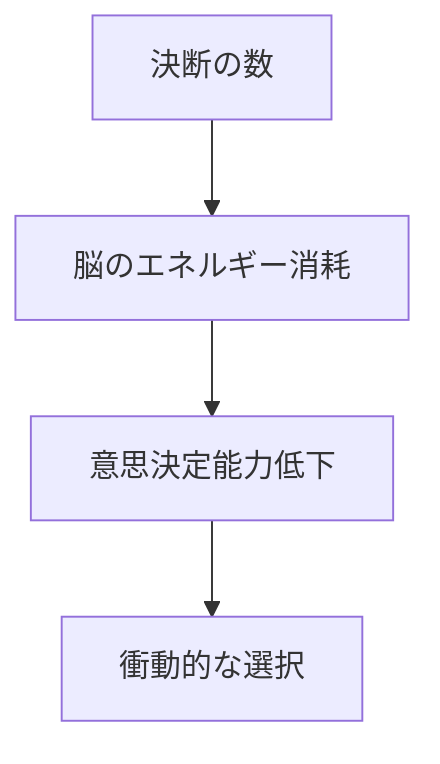
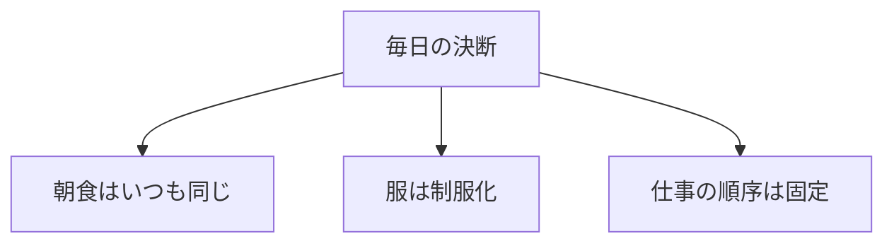
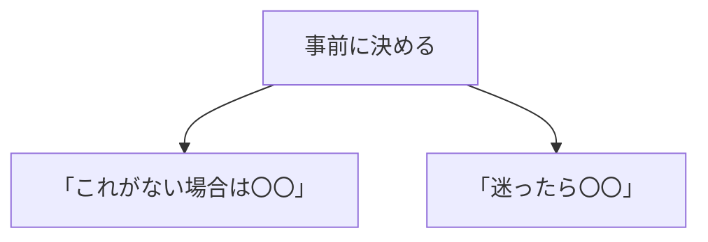

## はじめに

「朝、何を着よう？」

「昼、何を食べよう？」

「今日、何をしよう？」

私たちは1日に
何千回も決断しています。

そして、
**決断はエネルギーを消耗します**。

些細な決断に
脳を使い果たすと、
重要な決断で
ミスを犯します。

---

## 決断疲れのメカニズム

---

## 「選ばない」戦略

### ルーティン化

### デフォルト設定

---

## 実践できること

**① 朝のルーティンを固定**

毎日同じ順序で
同じことをする。

**② 服を制服化**

選択肢を減らす。

**③ 「デフォルト」を作る**

迷った時の
標準選択を決める。

**④ 重要な決断を朝に**

エネルギーが
最も高い時に。

---

## まとめ

「選ばない」ことは、
**「選ぶ力」を残す**こと。

些細なことに
エネルギーを使わず、
重要な決断に
集中する。

それが、
質の高い意思決定への
道です。

---

## セッションでできること

コーチングセッションでは、
あなたの決断パターンを分析し、
「選ばない」設計を
手伝います。

- 決断の棚卸し
- ルーティン化の設計
- デフォルト設定

**決断を減らし、
質を上げましょう。**
