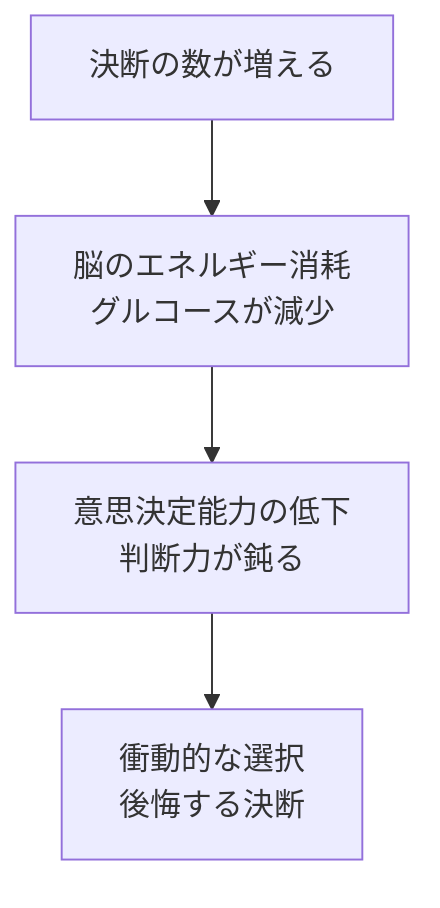
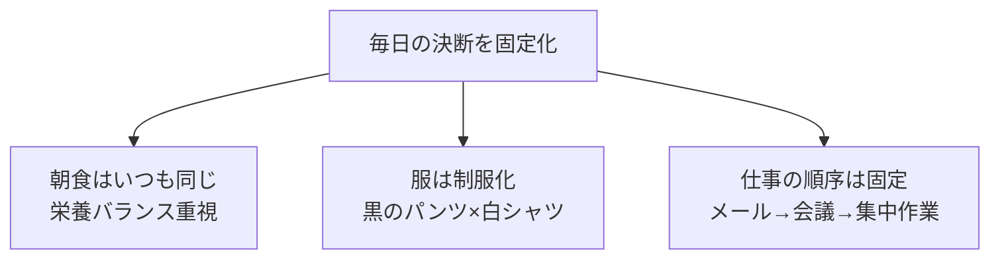
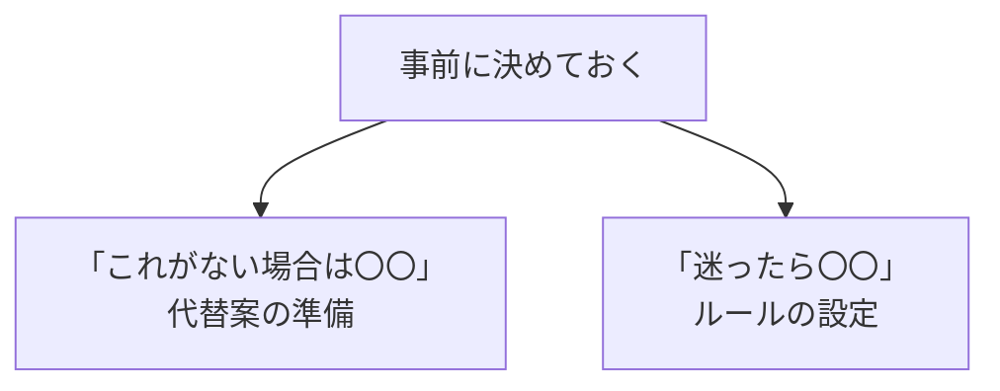
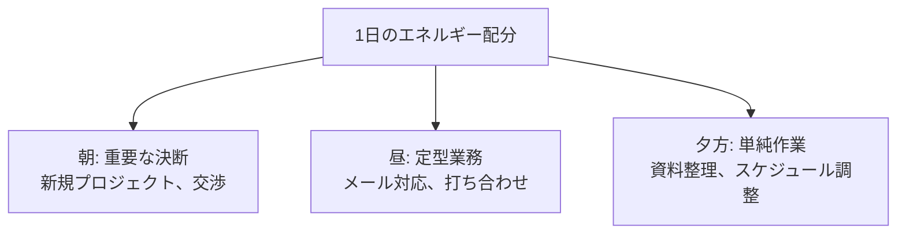

## はじめに

「朝、何を着よう？」「昼、何を食べよう？」「今日、何をしよう？」

私たちは1日に何千回も決断を下しています。しかし、**決断は脳のエネルギーを大量に消耗します**。

些細な決断に脳を使い果たすと、重要な決断の場面でミスを犯したり、衝動的な選択をしたりしてしまいます。

「選ばない」ことを選ぶ。それが、質の高い意思決定への第一歩です。

---

## 決断疲れがもたらす3つの悪影響

### 決断疲れのメカニズム

### 実験で明らかになった真実

スタンフォード大学の実験で、被験者たちは多くの選択をした後に、チョコレートケーキを選ぶ確率が大幅に上昇しました。判断疲れが蓄積されると、長期的な利益よりも即時的な快感を選びがちになるのです。

### 職場での決断疲れ

営業マンのKさんは、朝から細かい報告書のフォーマットを決め、昼食のメニューを考え、会議の順番を調整...といった些細な決断を繰り返していました。結果、重要なクライアントとの交渉で、焦って値引きを承诺してしまいました。

---

## 「選ばない」ための3つの戦略

### ルーティン化：毎日の決断を自動化する

Appleのスティーブ・ジョブズは、毎日同じ黒のタートルネックを着ていました。それは「毎朝何を着るか考える時間を節約するため」だったと言われています。 Zuckerbergも同様に、毎日同じ服を着ることで「他のことを決断するエネルギーを残す」と語っています。

### デフォルト設定：事前に「迷ったらこれ」を決める

例えば、「レストランで迷ったら野菜炒め」「服を選ぶのに5分以上迷ったら最初に手に取ったもの」といったルールを作っておきます。迷う時間を削減し、エネルギーを節約できます。

### 重要な決断を朝に集中させる

脳は朝に最も鋭く働きます。重要な会議、難しい交渉、創造的な作業は午前中に集中させましょう。

---

## 今日から始められる4つの実践法

### ① 朝のルーティンを固定する

毎日同じ順序で同じことをします。例：起床→水を飲む→10分ストレッチ→シャワー→朝食。これだけで、朝の無駄な決断が激減します。

### ② 服を「制服化」する

選択肢を3パターン程度に絞ります。例：月水金は黒パンツ×白シャツ、火木はグレーパンツ×青シャツ。週末に1週間分を決めておくのも有効です。

### ③ 「デフォルト」を3つ作る

- 昼食：迷ったら「サラダチキンセット」
- 晩御飯：迷ったら「外食は和食」
- 休日：迷ったら「公園で散歩」

### ④ 重要な決断を朝の10時までに済ませる

カレンダーで「重要決断タイム」をブロックし、その時間帯に新規プロジェクトの検討や、重要な交渉を予定します。

---

## まとめ

「選ばない」ことは、**「選ぶ力」を残す**ことです。

些細なことにエネルギーを使わず、重要な決断に集中することで、質の高い意思決定が可能になります。

**今日から、朝のルーティンを固定してみませんか？** 小さな変化が、大きな成果につながります。

---

## セッションでできること

コーチングセッションでは、あなたの決断パターンを専門的に分析し、「選ばない」設計を一緒に作り上げます。

- 1日の決断リスト作成と優先順位付け
- パーソナライズされたルーティン化設計
- デフォルト設定の作成と実践サポート

**決断を減らし、質を上げましょう。**
