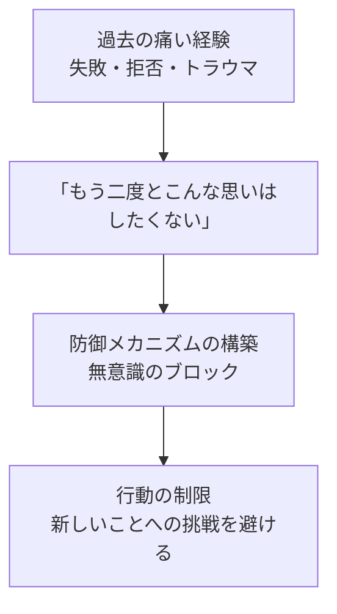
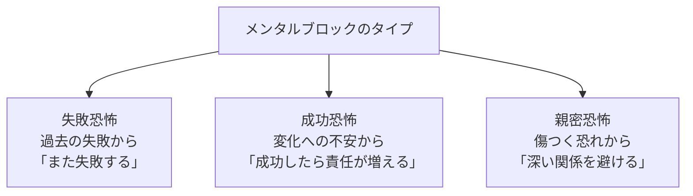
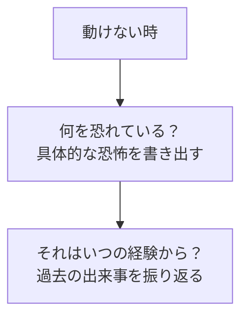
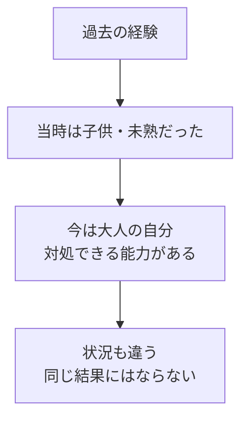
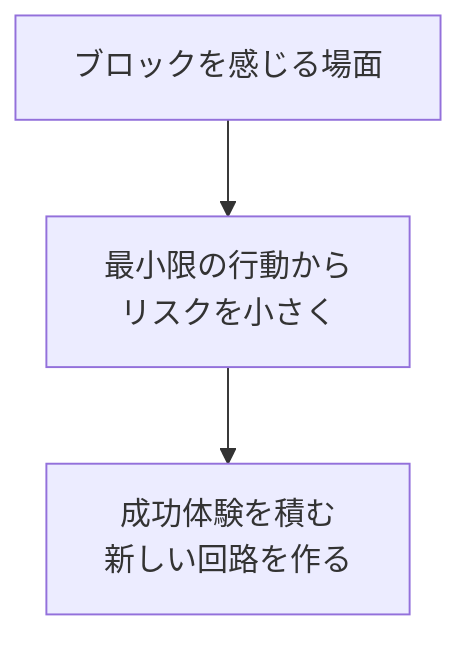

## はじめに

「なぜか動けない...」「何かが邪魔をしている...」

そんな経験、ありませんか？実は、それは**過去の経験が今の行動を縛っている**からかもしれません。

メンタルブロックは、もともとは**守るための仕組み**でした。しかし、今は**成長の妨げ**になっています。

この記事では、ブロックの正体を知り、それを癒して前に進む方法を解説します。

---

## メンタルブロックができる3つのプロセス

### ブロックの形成メカニズム

たとえば、小さい頃に人前で失敗して酷く笑われた経験があると、「人前に出る＝痛い思いをする」という脳内回路が作られます。それが、大人になってもプレゼンを極度に恐れるブロックとして残ります。

### よくある3つのメンタルブロック

---

## ブロックを癒す3ステップのプロセス

### ステップ1：認識～「何を恐れているか」を明らかにする

フリーライターのMさんは、「新しいクライアントを取りに行けない」ブロックがありました。掘り下げると、前職で営業先で酷い扱いを受けた経験が原因でした。「営業＝自分を傷つけられる」という回路が作られていたのです。

### ステップ2：再評価～「今は違う」と脳に教える

脳科学者によると、トラウマ記憶は「今も現在進行形で危険だ」と誤認識しています。意識的に「あの時はあの時、今は違う」と更新することで、脳の反応を変えられます。

### ステップ3：小さく試す～新しい経験で上書きする

Mさんは、まず「メールでの問い合わせ」から始めました。電話ではなく、メールならリスクが少ない。成功体験を積み重ねることで、徐々にブロックが緩和されていきました。

---

## 今日から始められる4つの実践法

### ① ジャーナリング～「動けない時」の感情を書き出す

「何をしようとした時」「何を感じたか」「体のどこにその感情があるか」を書き出します。これだけで、ブロックの正体が見えてきます。

### ② 幼少期の自分と対話する

「あの時の自分は、どんな気持ちだっただろう？」と想像し、今の自分が「もう大丈夫だよ」と伝えてあげます。内なる子供の癒しは、ブロック解除に非常に有効です。

### ③ プロフェッショナルに相談する

深いブロックは、一人で解決するのは難しいことがあります。コーチやカウンセラーに相談することで、安全にブロックを解除できます。

### ④ 小さく、何度も試す

「完璧」を求めず、小さな一歩を何度も踏み出します。失敗しても「また試せばいい」と考えましょう。

---

## まとめ

メンタルブロックは、**過去の傷の名残**です。

それを癒し、再評価することで、**自由と成長の道が開かれます**。

過去に縛られず、未来へ進むために。**今日からジャーナリングを始めてみませんか？**

---

## セッションでできること

コーチングセッションでは、あなたのメンタルブロックを安全に探索し、専門的なワークで解放をサポートします。

- ブロックの特定とその正体の解明
- 過去の再評価と新しい視点の構築
- 前進のための具体的アクションプラン作成

**過去を手放し、未来を歩きましょう。**
