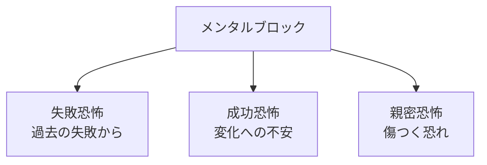
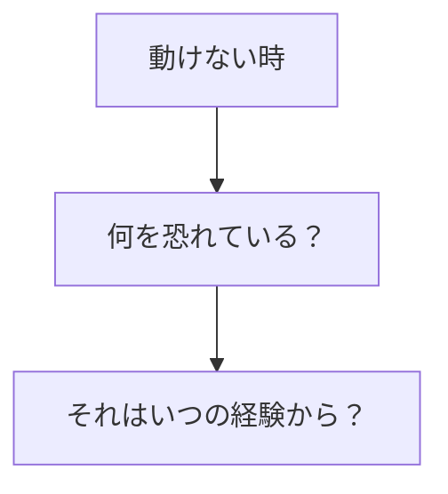
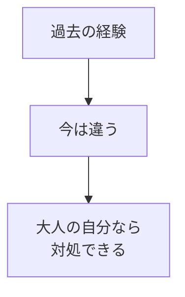

## はじめに

「なぜか動けない...」

「何かが邪魔をしている...」

それは、
**過去の経験が
今の行動を縛っている**からかも
しれません。

メンタルブロックは、
**守るための仕組み**でした。

でも、今は
**成長の妨げ**になっています。

---

## メンタルブロックの正体

### 形成プロセス

```mermaid
graph TD
    A[過去の痛い経験] --> B[「もう二度と"]
    B --> C[防御メカニズム]
    C --> D[行動の制限]
```

### よくあるブロック



---

## 癒しのプロセス

### 認識



### 再評価



---

## 実践できること

**① ジャーナリング**

「動けない時」の
感情を書き出す。

**② 幼少期の自分と対話**

あの時の自分に、
今の自分が伝える。

**③ プロフェッショナルに相談**

深いブロックは、
専門家のサポートを。

**④ 小さく試す**

ブロックを感じる時、
最小限の行動から。

---

## まとめ

メンタルブロックは、
**過去の傷の名残**です。

それを癒し、
再評価することで、
**自由が生まれます**。

過去に縛られず、
未来へ進みましょう。

---

## セッションでできること

コーチングセッションでは、
あなたのメンタルブロックを
安全に探索し、
解放をサポートします。

- ブロックの特定
- 過去の再評価
- 前進の支援

**過去を手放し、
未来を歩きましょう。**

[→ 体験セッションの詳細を見る](/sessions)
