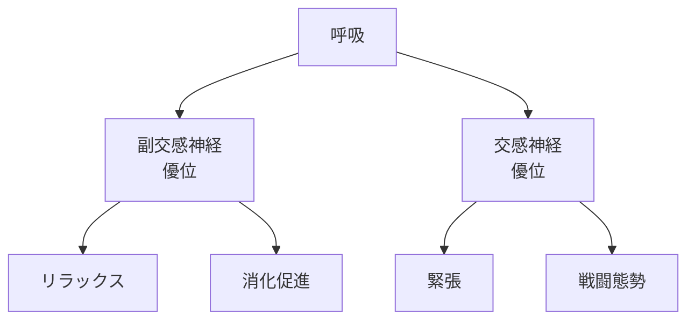
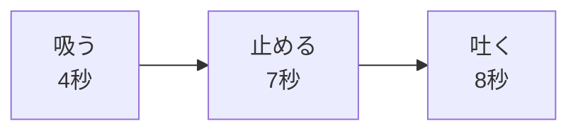
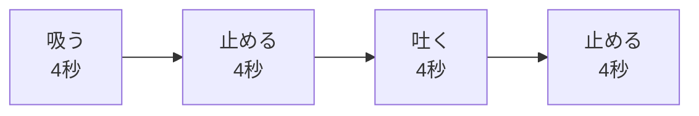

## はじめに

「落ち着きたい...」

「緊張を和らげたい...」

そんな時、
**呼吸**が最も強力なツールです。

薬も道具も不要。
**いつでもどこでも**
使えます。

---

## 呼吸の科学

### 自律神経への影響

---

## 実践テクニック

### 4-7-8呼吸

### 箱呼吸

---

## 実践できること

**① 朝の呼吸**

目覚めたら、
10回深呼吸。

**② ストレス時**

4-7-8呼吸を
3セット。

**③ 寝る前**

箱呼吸で
リラックス。

**④ 日常のチェック**

1日3回、
呼吸を意識する。

---

## まとめ

呼吸は、
**心身のコントロールパネル**です。

意識的に使えば、
数秒で状態を変えられます。

いつでも頼れる、
あなたの最強ツール。

---

## セッションでできること

コーチングセッションでは、
あなたに最適な
呼吸法を伝授し、
実践をサポートします。

- 呼吸パターンの分析
- 最適な呼吸法の選択
- 日常への組み込み

**呼吸で、
心を整えましょう。**

[→ 体験セッションの詳細を見る](/sessions)
