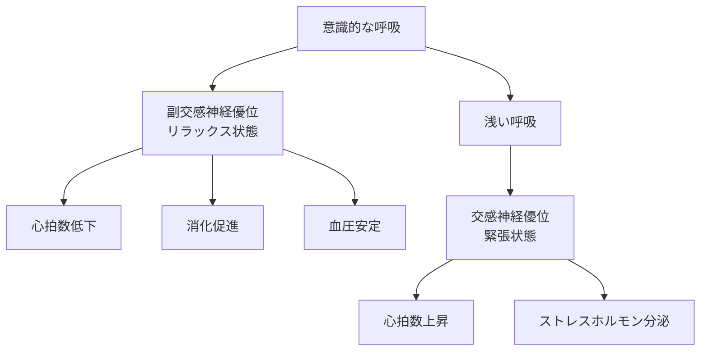
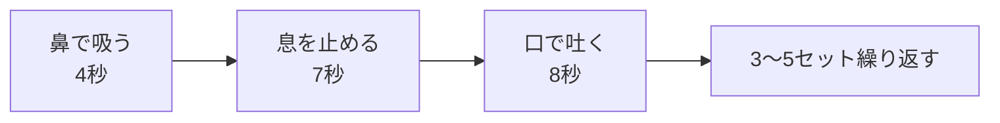
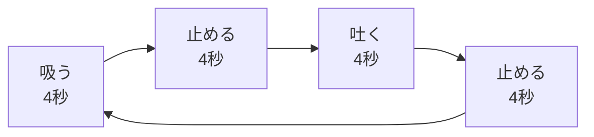

## はじめに

「落ち着きたい...」「緊張を和らげたい...」

そんな時、あなたは何をしますか？実は、**呼吸**が最も強力なツールなんです。

薬も道具も不要。**いつでもどこでも**使えます。

この記事では、呼吸の科学と、自律神経をコントロールする実践的なテクニックを解説します。

---

## 呼吸が自律神経に与える3つの影響

### 呼吸と自律神経の関係

ハーバード大学の研究によると、深い呼吸を行うだけで、数秒で副交感神経が優位になり、リラックス状態に入ることができます。

### 呼吸が変わると何が起きるか

プレゼン前に緊張して呼吸が浅くなると、脳に酸素が十分に行き渡らず、判断力が鈍り、記憶の思い出しも悪化します。逆に、深い呼吸をすることで、脳の機能が最大限に引き出されます。

実際の例を挙げましょう。営業マンのSさんは、大切なプレゼン直前に緊張で呼吸が浅くなり、喉が渇き、頭が真っ白になってしまいました。しかし、4-7-8呼吸を3セット行ったところ、心拍数が落ち着き、スムーズにプレゼンを行えるようになりました。「呼吸を整えるだけで、こんなに違うのか」と驚いたそうです。

---

## 今日から使える2つの実践テクニック

### 4-7-8呼吸：最も効果的なリラックス法

これは、ハーバード大学医学部のウェル博士が開発した方法です。副交感神経を活性化させ、数分でリラックス状態を作り出します。

**実践例：** 営業担当のTさんは、大切な交渉の前に必ず4-7-8呼吸を3セット行っています。「緊張が和らぎ、頭がクリアになる」と言います。

### 箱呼吸：パフォーマンスを最大にする技法

 Navy SEALs（米海軍特殊部隊）も採用している技法です。緊張を和らげつつも、高い集中力を維持できます。

---

## 日常に組み込む4つの実践法

### ① 朝の呼吸で1日を整える

目覚めたら、ベッドで10回深呼吸。これだけで、交感神経と副交感神経のバランスが整い、穏やかな1日のスタートが切れます。

### ② ストレス時には4-7-8呼吸

怒りや不安を感じた時、すぐに4-7-8呼吸を3セット。トイレや車内でもできるので、仕事中の「リセットボタン」として活用できます。

特に、会議で強い言葉を言われた後や、メールで嫌な返事をもらった後など、感情が高ぶった時に有効です。即座に4-7-8呼吸を行うことで、衝動的な反応を避け、冷静な判断ができるようになります。

### ③ 寝る前に箱呼吸で深い睡眠へ

ベッドに入ったら、箱呼吸を5分間。心拍数が下がり、自然と眠気が訪れます。睡眠の質も向上します。

### ④ 日常の「トリガー」を設定する

ドアを開ける時、電話を受ける時、赤信号で停止した時...これらを「呼吸チェック」の合図にします。1日3回、意識して呼吸を深くするだけで効果があります。

トリガーを設定することで、意識的に「今、呼吸を整える」という習慣が身につきます。最初は意識的ですが、数週間続けると無意識に行えるようになり、常にリラックスした状態を保てるようになります。

---

## まとめ

呼吸は、**心身のコントロールパネル**です。

意識的に使えば、数秒で状態を変えられます。薬も道具も不要で、いつでもどこでも使える、あなたの最強ツールです。

**今日から、朝の10回深呼吸を始めてみませんか？** 小さな習慣が、大きな変化をもたらします。

---

## セッションでできること

コーチングセッションでは、あなたに最適な呼吸法を伝授し、実践をサポートします。

- あなたの呼吸パターンの分析と改善提案
- 状況別（緊張時・疲労時・集中時）最適な呼吸法の選択
- 日常への組み込み計画と習慣化サポート

**呼吸で、心を整えましょう。**
