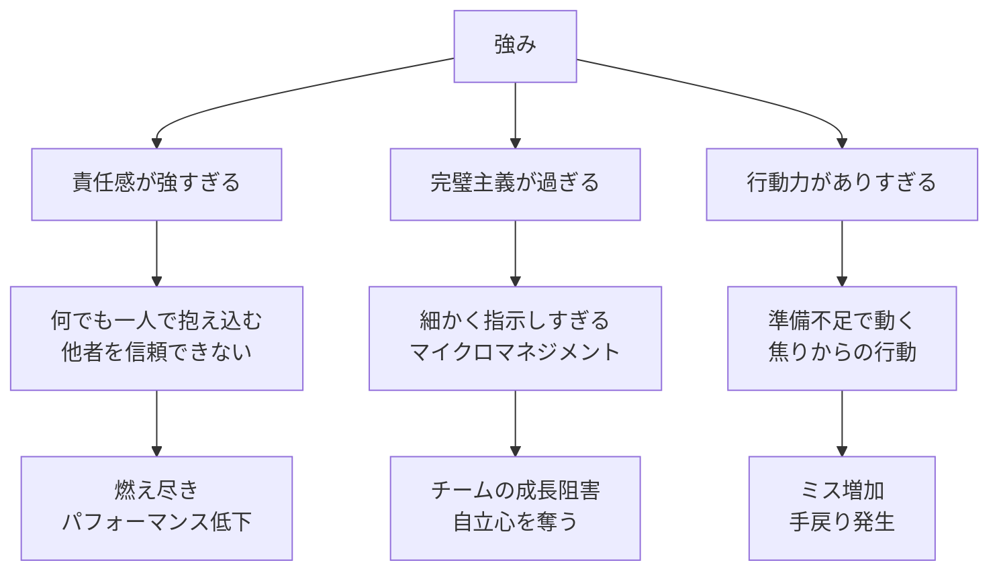
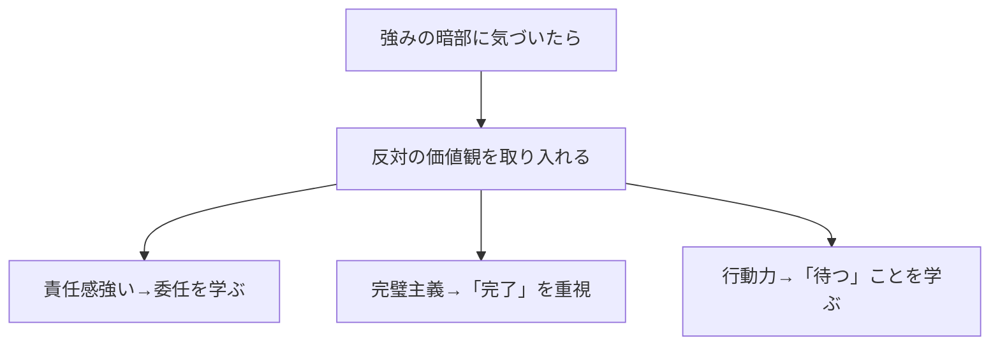
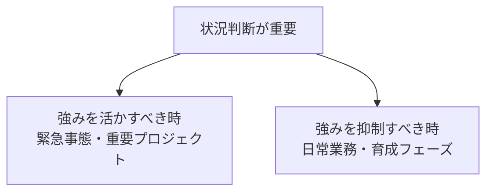
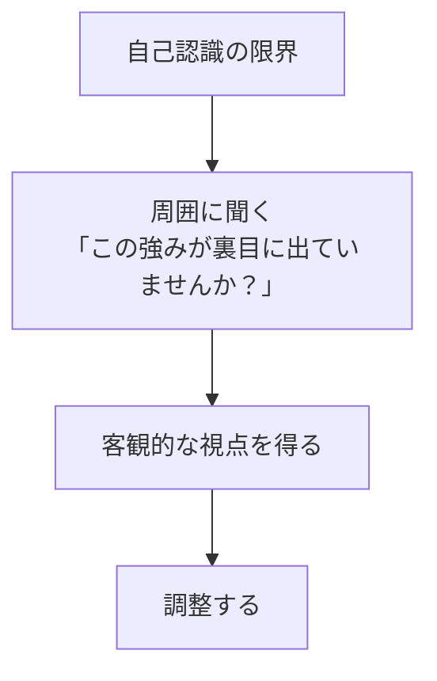

## はじめに

「責任感が強いのに、なぜか疲れ果てる...」「完璧主義で、チームを疲弊させてしまう...」

そんな経験、ありませんか？

実は、強みは**行き過ぎると弱点**になるんです。

- 責任感 → 抱え込み → 燃え尽き
- 完璧主義 → マイクロマネジメント → チームの自立阻害
- 行動力 → 焦り → ミス増加

**強みの「暗部」**を知り、調整することが、真の強みを発揮する秘訣です。

---

## 強みの暗部が生じる3つのメカニズム

### 強みが暗部に転じるプロセス

### 実際のケーススタディ

管理職のKさんは、「責任感が強い」という強みを持っていました。しかし、部下の仕事を逐一確認し、修正を入れ続けました。結果、部下は「自分で考えることをやめ」、Kさんの負担は増大し、最終的に休職に至りました。

---

## 暗部を調整する3つの方法

### 方法1：反対の価値観を取り入れる

著名な経営コンサルタント、大前研一氏も「決断力」が強みでしたが、若い頃は「待つこと」の重要性を学んだと語っています。強みの反対側を意識的に取り入れることで、バランスが生まれます。

### 方法2：状況に応じて使い分ける

例えば、完璧主義は「顧客向けの重要提案書」では活かすべきですが、「部下への日常業務の指示」では抑制すべきです。

### 方法3：フィードバックを定期的に受ける

自分では気づきにくいのが暗部です。信頼できる同僚や部下に定期的にフィードバックをもらう習慣を作りましょう。

---

## 今日から始められる3つの実践法

### ① 自分の強みリストとその暗部を書き出す

紙に自分の強みを3つ書き、それぞれの「行き過ぎるとどうなるか」を書き出します。意識することで、セルフモニタリングができるようになります。

### ② 「この場面では逆の行動をする」を決める

例：責任感が強い人は「今日は部下に任せて、絶対に口出ししない」というルールを作る。完璧主義の人は「今日は80点で出す」と決める。

### ③ 1週間に1回、フィードバックを求める

「最近、私の行動で気になることはありますか？」と、同僚やパートナーに聞いてみましょう。特に「強みが裏目に出ていないか」に注目してもらいます。

---

## まとめ

強みは宝ですが、**使い方次第**です。

暗部を知り、調整することで、**真の強み**となります。完璧な自分を目指すのではなく、バランスの取れた自分を目指しましょう。

**今日から、自分の強みとその暗部を1つ書き出してみませんか？**

---

## セッションでできること

コーチングセッションでは、あなたの強みと暗部を専門的に分析し、バランスの取り方を一緒に探ります。

- ストレングスファインダー等を使った強みの特定
- 暗部の認識とその影響の把握
- 状況に応じた調整戦略の設計

**強みを、もっと上手に使いましょう。**
