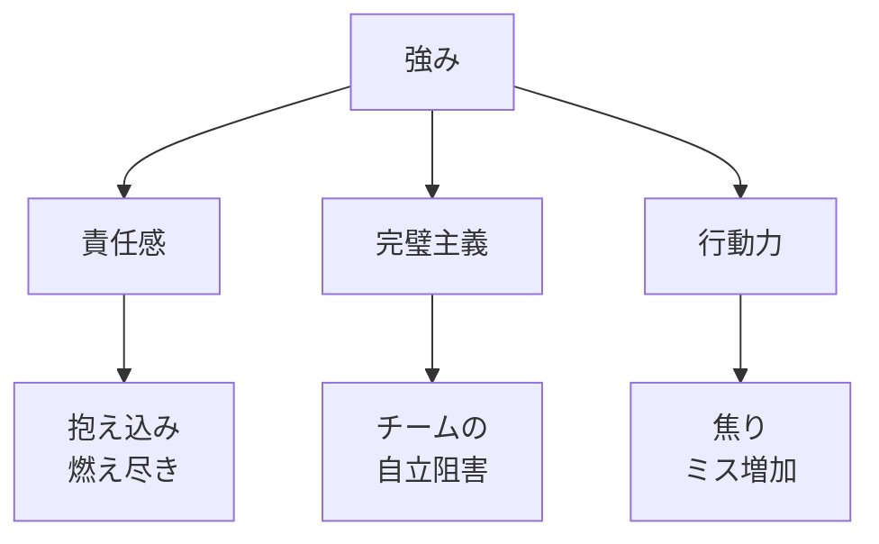
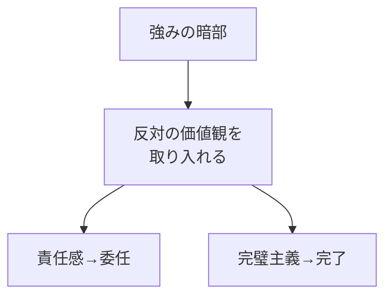
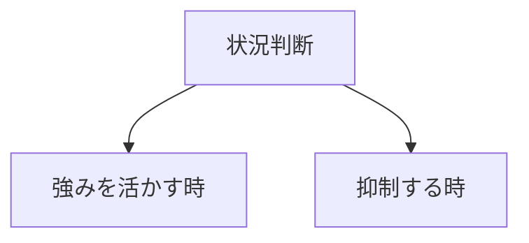

## はじめに

「責任感が強いのに、
なぜか疲れ果てる...」

「完璧主義で、
チームを疲弊させてしまう...」

強みは、
**行き過ぎると弱点**になります。

責任感→抱え込み
完璧主義→マイクロマネジメント
行動力→焦り

**強みの「暗部」**を知り、
調整することが大切です。

---

## 強みの暗部

### 例

---

## 調整の方法

### バランスを取る

### 状況に応じて

---

## 実践できること

**① 強みのリスト**

自分の強みを書き出し、
暗部を考える。

**② フィードバックを求める**

「この強みが
裏目に出ていませんか？」

**③ 反対の行動を試す**

責任感が強い人は、
意識的に委任する。

---

## まとめ

強みは宝ですが、
**使い方次第**です。

暗部を知り、
調整することで、
**真の強み**となります。

---

## セッションでできること

コーチングセッションでは、
あなたの強みと暗部を分析し、
バランスの取り方を
一緒に探ります。

- 強みの特定
- 暗部の認識
- 調整戦略

**強みを、
もっと上手に使いましょう。**

[→ 体験セッションの詳細を見る](/sessions)
