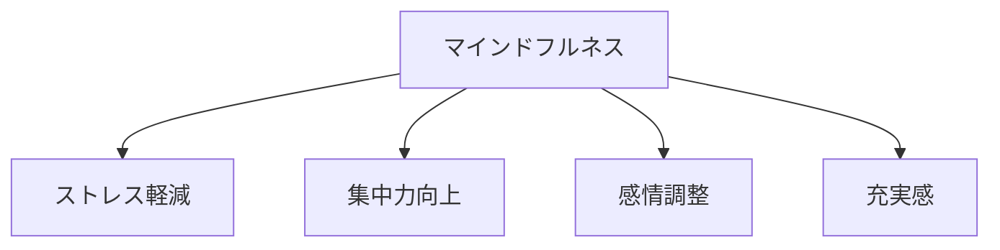
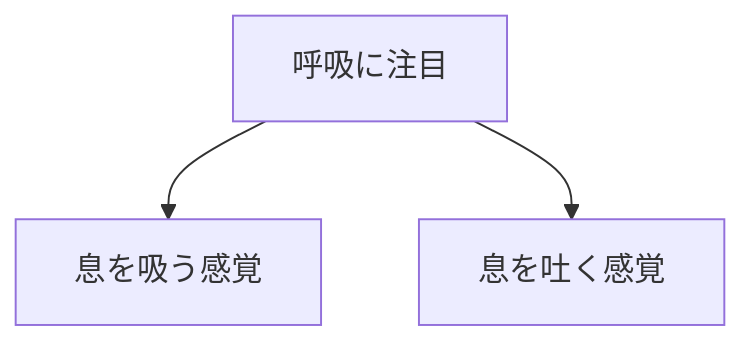
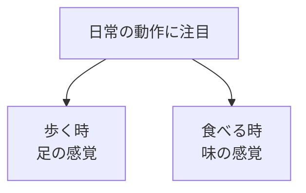

## はじめに

「過去のことを
思い出して落ち込む...」

「未来のことを
考えて不安になる...」

私たちの心は、
**「今」にいることを
忘れがち**です。

マインドフルネスは、
**今この瞬間に
意識を戻す練習**です。

---

## マインドフルネスの効果

---

## 実践方法

### 基礎

### 日常への応用

---

## 実践できること

**① 朝の3分**

目覚めたら、
呼吸に集中。

**② 日常の「アンカー」**

ドアを開ける時、
電話を受ける時...

**③ 食事のマインドフルネス**

最初の3口は
味わって食べる。

---

## まとめ

マインドフルネスは、
**「今」を生きる力**です。

過去も未来もなく、
ただ「今」にいる。

それが、
充実感の源です。

---

## セッションでできること

コーチングセッションでは、
マインドフルネスの
基礎から応用まで
サポートします。

- 瞑想のガイド
- 日常への組み込み
- ストレス時の活用

**今を生きる力を、
一緒に育てましょう。**
