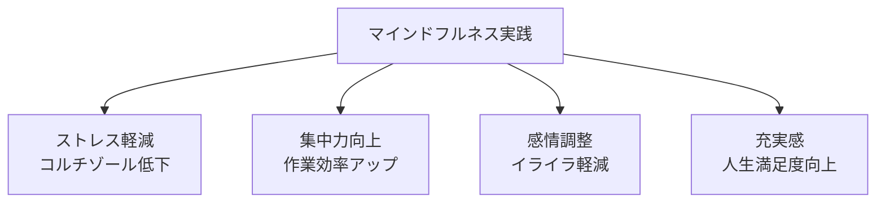
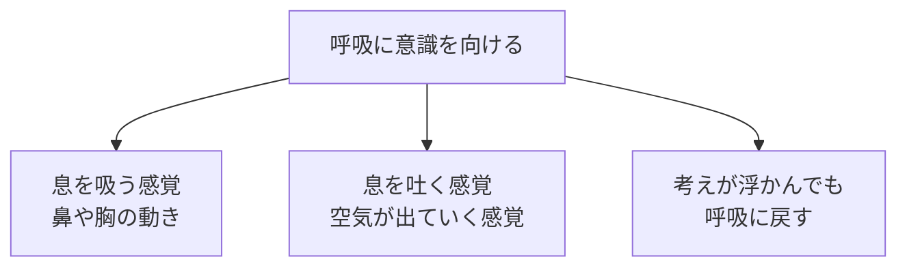
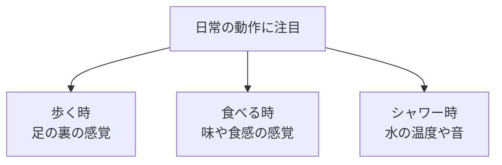

## はじめに

「過去のことを思い出して落ち込む...」「未来のことを考えて不安になる...」

私たちの心は、**「今」にいることを忘れがち**です。

マインドフルネスは、**今この瞬間に意識を戻す練習**です。瞑想と思われがちですが、実は日常生活のあらゆる場面で実践できるシンプルな技法です。

---

## マインドフルネスがもたらす4つの効果

### マインドフルネスの効果マップ

### 科学的に証明された効果

Google社内の「Search Inside Yourself」プログラムでは、マインドフルネス研修を受けた従業員のストレスレベルが大幅に低下し、創造性が向上したことが報告されています。

また、マインドフルネスを8週間実践しただけで、脳の「扁桃核（恐怖や不安を処理する部分）」の活動が低下し、「前頭前野（理性や集中を司る部分）」の活動が活発化することが脳科学研究で明らかになっています。

実際に、あるプロジェクトマネージャーKさんは、マインドフルネスを実践し始めて3ヶ月後、「会議中に気が散ることが減り、重要なポイントを見落とすことがなくなった」と報告しています。以前はスマホを気にしながら会議に参加していましたが、今はその場に100%集中できるようになったそうです。

---

## 実践方法：基礎から日常応用まで

### 基礎：呼吸に注目する

これだけです。3分間、呼吸に注意を向けるだけで、脳の状態が変わります。初心者は「考えが浮かんでしまう」と不安になりますが、それは自然なこと。浮かんだら、そっと呼吸に戻すだけです。

### 日常への応用：日常動作を「アンカー」にする

僧侶である一行禅師は、「食事をする時は食事に、歩く時は歩くことに集中する」という教えを説きました。日常の当たり前の動作に意識を向けるだけで、心は「今」に戻ってきます。

---

## 今日から始められる4つの実践法

### ① 朝の3分間：目覚めたら呼吸に集中

目覚めたら、スマホを見る前に、ベッドで3分間、呼吸に集中します。「今日はどんな1日になるか」という思考に流されず、ただ呼吸を感じる。これだけで、1日の基調が変わります。

### ② 日常の「アンカー」を設定する

ドアを開ける時、電話を受ける時、コーヒーを飲む時...これらを「マインドフルネスの合図」にします。その瞬間、一呼吸おいて、「今、ここにいる」ことを意識します。

例えば、職場のドアを開けるたびに「今、ここにいる」と意識すると、仕事に没頭できるようになります。習慣化すると、自然と「今」に意識が向くようになります。

### ③ 食事のマインドフルネス：最初の3口

忙しくても、食事の最初の3口は味わって食べることにします。食べ物の香り、舌の上での触感、味の変化...意識的に感じるだけで、食事の質が変わります。

### ④ 通勤・通学中の「歩く瞑想」

移動中に音楽やポッドキャストを聴くのをやめて、歩く感覚に意識を向けます。足が地面につく感覚、周囲の音、空気の温度...10分でも、心が整います。

---

## まとめ

マインドフルネスは、**「今」を生きる力**です。

過去も未来もなく、ただ「今」にいる。それが、充実感とパフォーマンスの源です。

「難しい」「時間がない」という先入観を捨てて、まずは朝の3分間から始めてみましょう。

**今日から、目覚めたらスマホを見る前に、3回深呼吸してみませんか？**

---

## セッションでできること

コーチングセッションでは、マインドフルネスの基礎から応用まで、あなたのライフスタイルに合わせてサポートします。

- 初心者向け瞑想のガイドと練習
- 日常業務へのマインドフルネスの組み込み方
- ストレス時のマインドフルネス活用テクニック

**今を生きる力を、一緒に育てましょう。**
