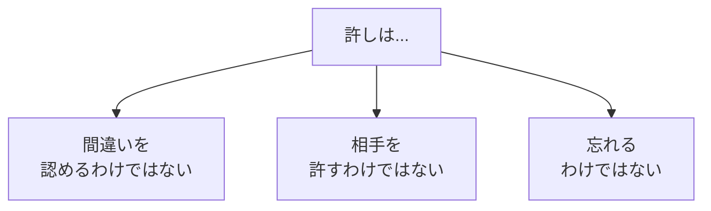
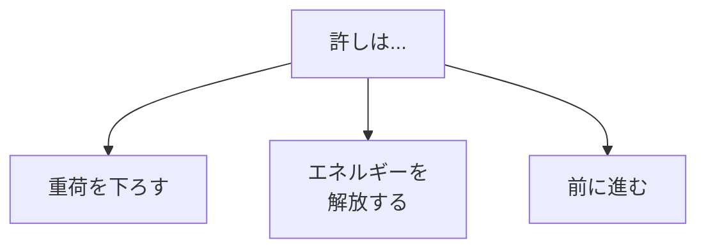
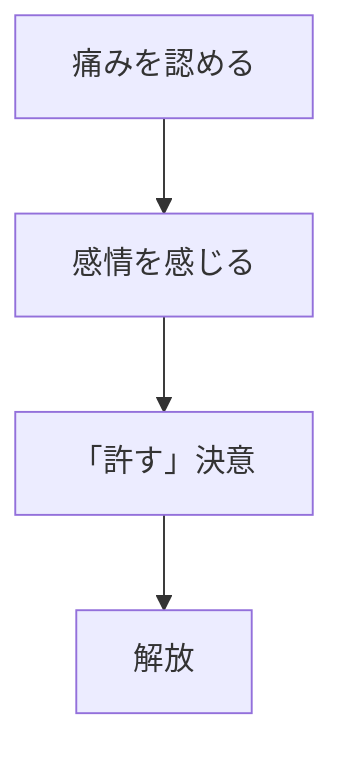

## はじめに

「あの時のことを
許せない...」

「自分の過ちが
忘れられない...」

許せない気持ちは、
**自分自身を縛る鎖**です。

許すことは、
**相手のためではなく、
自分のため**です。

重荷を下ろし、
軽やかに生きましょう。

---

## 許しの意味

### 何ではないか

### 何であるか

---

## 許しのプロセス

---

## 実践できること

**① 手紙を書く**

許したい相手に、
書いて破る。

**② 自分への許し**

「あの時の自分は
最善を尽くした」

**③ 儀式**

書いたものを
燃やす、流す...

---

## まとめ

許しは、
**自分への贈り物**です。

過去を手放し、
今にエネルギーを集中。

軽やかに、
前へ進みましょう。

---

## セッションでできること

コーチングセッションでは、
許しのプロセスを
安全に進めます。

- 過去の整理
- 感情の処理
- 解放の支援

**重荷を下ろし、
自由になりましょう。**
