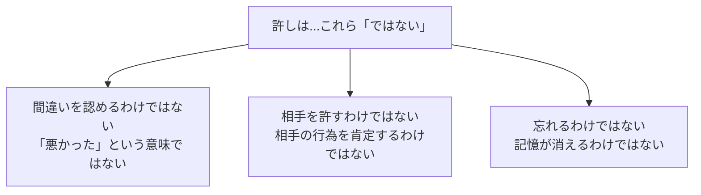
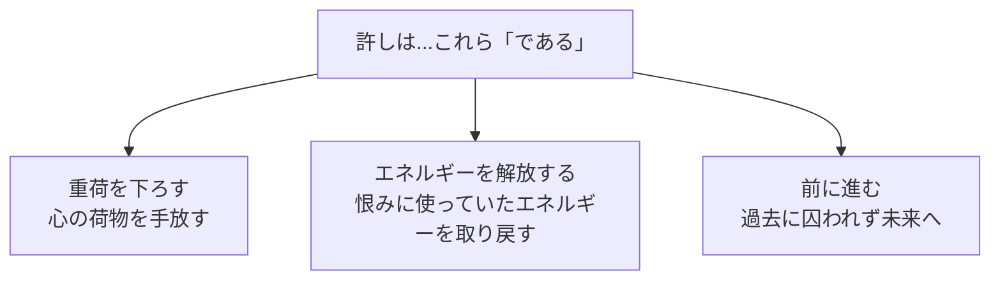
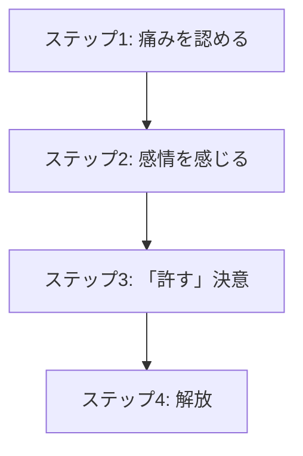

## はじめに

「あの時のことを許せない...」「自分の過ちが忘れられない...」

そんな重荷を、いつまでも背負っていませんか？

許せない気持ちは、**自分自身を縛る鎖**なんです。

許すことは、**相手のためではなく、自分のため**です。重荷を下ろし、軽やかに生きるために、許しのプロセスを理解しましょう。

---

## 許しの本当の意味：3つの誤解と真実

### 許しとは何ではないか

### 許しとは何であるか

### 許しの科学

スタンフォード大学の研究によると、許すことで、心拍数が低下し、血圧が安定し、免疫機能が向上することが明らかになっています。「許さない」ことは、自分の身体にも毒を与えているのです。

実際の例を見てみましょう。30代の会社員Mさんは、前の上司から酷い扱いを受けた経験があり、何年も恨みを抱えていました。その間、不眠症になり、人間関係もうまくいきませんでした。カウンセリングで「許しのワーク」を行った後、徐々に心が軽くなり、今では新しい人間関係を築けるようになったと言います。「許すことは相手のためじゃなく、自分を救うことだった」と語っています。

---

## 許しの4ステッププロセス

### ステップ1：痛みを認める

「あの時、本当に傷ついた」「あの経験はつらかった」と、経験した痛みを否定せず、認めます。痛みを押し込めると、許しは起こりません。

### ステップ2：感情を感じる

怒り、悲しみ、悔しさ...その感情を感じます。感情を「悪いもの」とせず、ただ感じて通過させます。

### ステップ3：「許す」決意をする

「もうこの恨みにエネルギーを使わない」と決意します。これは一瞬のことではなく、何度も繰り返すプロセスです。

### ステップ4：解放する

過去の重荷から手を放ち、今の自分のエネルギーを現在と未来に向けます。

---

## 今日から始められる4つの実践法

### ① 手紙を書く（送らない）

許したい相手に手紙を書きます。感情を正直に綴り、最後に「あなたを許します」と書きます。そして、その手紙を破り捨てるか、燃やします。これだけで、大きな解放感が得られます。

手紙を書くことで、混沌とした感情が言葉になり、整理されます。書き終わった後、多くの人が「肩の荷が下りた」と感じるのです。送らなくても、書く行為自体に治癒効果があります。

### ② 自分への許しを与える

「あの時の自分は、あの時の知識と能力で最善を尽くした」と言い聞かせます。今の自分で過去の自分を責めても、何も生まれません。

### ③ 儀式を行う

書いた手紙を燃やす、川に流す、風に吹き飛ばす...「手放す」という身体的行為が、心理的手放しを助けます。

### ④ エネルギーの「再投資」を意識する

「許すことで、どこにエネルギーを使いたいか」を書き出します。新しい趣味、大切な人との時間、目標の追求...許しが新しい可能性を開きます。

---

## まとめ

許しは、**自分への贈り物**です。

過去を手放し、今にエネルギーを集中することで、軽やかに前へ進むことができます。

相手のためではなく、自分のために。許しのプロセスを始めてみませんか？

**今日から、許したい相手（あるいは自分）に手紙を書いてみませんか？** 書いて破るだけで、心は少し軽くなります。

---

## セッションでできること

コーチングセッションでは、許しのプロセスを安全に、段階的に進めるサポートをします。

- 過去の経験の整理と意味付け
- 感情の処理と解放のサポート
- 許しの決意から未来への移行支援

**重荷を下ろし、自由になりましょう。**
