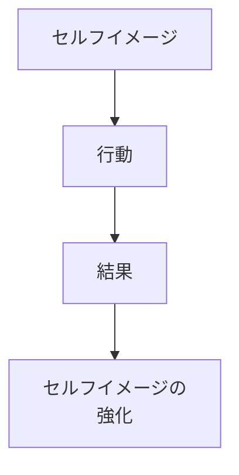
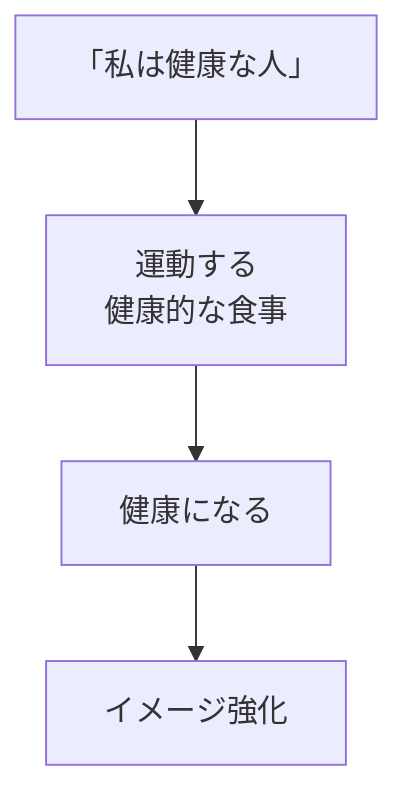
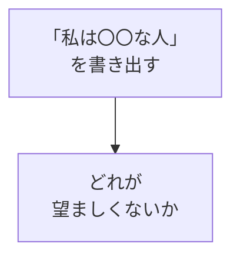
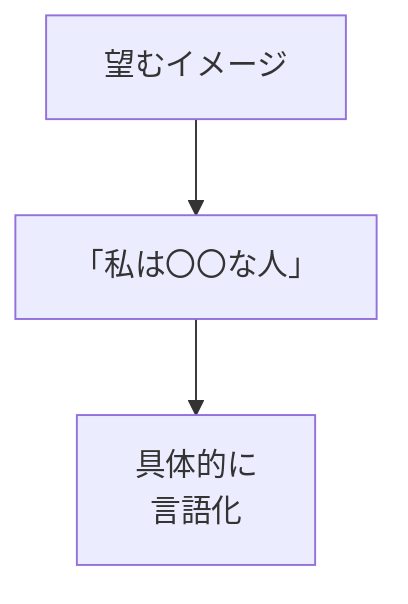
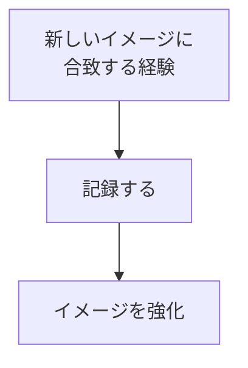

## はじめに

「私はできない人間だ」

「私は運が悪い」

そう思い込んでいませんか？

その「思い込み」が、
**現実を作っています**。

セルフイメージとは、
**「自分はこういう人」という
自己定义**です。

それを変えると、
行動が変わり、
現実が変わります。

---

## セルフイメージの力

### メカニズム

### 例

---

## 書き換えの方法

### 1. 現在のイメージを知る

### 2. 新しいイメージを設定

### 3. エビデンスを集める

---

## 実践できること

**① イメージの棚卸し**

「私は...」を
10個書き出す。

**② 新しいアファメーション**

毎朝、新しいイメージを
声に出す。

**③ 小さな成功体験**

新しいイメージに
合致する行動を
小さく始める。

---

## まとめ

セルフイメージは、
**現実の設計図**です。

設計図を変えれば、
作られるものも変わります。

「どんな自分」に
なりたいですか？

---

## セッションでできること

コーチングセッションでは、
あなたのセルフイメージを
分析し、
書き換えをサポートします。

- 現在のイメージ分析
- 望むイメージの設定
- 書き換えの実践

**新しい自分を、
一緒に作りましょう。**
