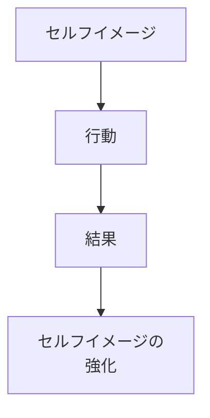
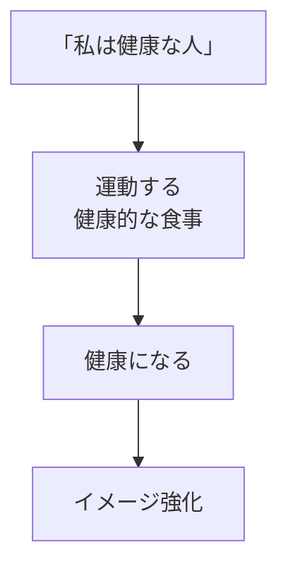
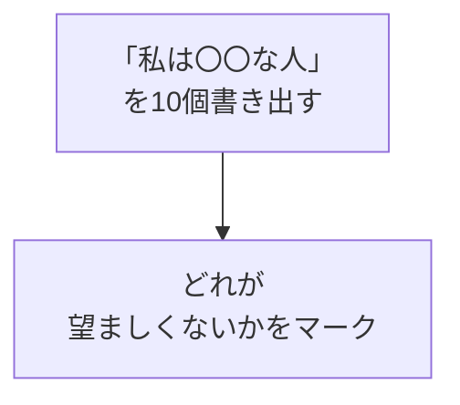
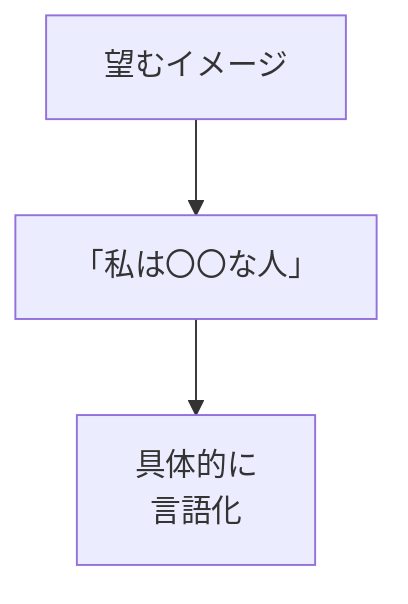
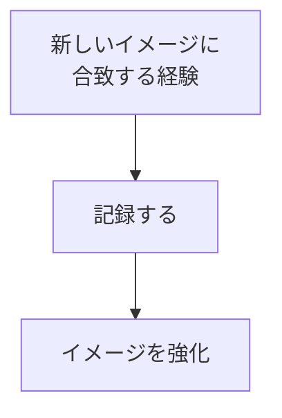

## はじめに

「私はできない人間だ」

「私は運が悪い」

そう思い込んでいませんか？

その「思い込み」が、
**現実を作っています**。

セルフイメージとは、
**「自分はこういう人」という
自己定義**です。

それを変えると、
行動が変わり、
現実が変わります。

---

## セルフイメージがもたらす3つの変化

### メカニズムの全体像

### 変化① 行動が自動化される

セルフイメージは「無意識のフィルター」として機能します。
「私は健康な人」と思えば、自ずと階段を選んだり野菜を選んだり。
意識的な努力なしに、イメージに沿った行動を取ります。

### 変化② 結果が自己実現する

**「ピグマリオン効果」**と呼ばれる心理現象があります。
教師が「この生徒は成績が上がる」と期待すると、生徒の成績が実際に上がる——という実験結果です。
自分自身への期待も同じ。高いイメージを持てば、現実がそれに追いつきます。

### 変化③ 感情とストレス耐性が向上する

「自分は克服できる人」というイメージを持つと、困難に直面しても「これも成長のチャンス」と捉えられます。イメージが感情の土台になるのです。

**例：健康的なセルフイメージ**

---

## セルフイメージが書き換わる実例

### ケース1：会社員→起業家への変身

30代のSさん。「私はリスクを取れない人」というイメージに縛られ、10年間同じ会社にいました。

リライトしたイメージは「私はチャレンジを楽しむ人」。最初は小さな副業から始め、失敗しても「挑戦している証拠」と受け止められるようになったところ、1年後に独立。今は年収も3倍になり、「もっと早く書き換えればよかった」と言っています。

### ケース2：社交不安からの解放

大学生のKさん。「私は人前で話すのが苦手な人」というイメージが、いざという時の緊張を招いていました。

イメージを「私は緊張しても伝えたいことを伝えられる人」に変え、ミーティングで1分間だけ発言する練習を重ねました。3ヶ月後、プレゼン大会で3位を獲得。本人も「同じ自分なのに、イメージ次第でこんなに変わるなんて」と驚いていました。

---

## セルフイメージを書き換える4ステップ

### ステップ1：現在のイメージを棚卸しする

ノートに「私は〜」で始まる文章を書き出してください。「私は几帳面な人」「私は人と競争するのが嫌いな人」など。書き出したら、各イメージについて「これは事実か、それとも解釈か？」と問いかけてみましょう。

### ステップ2：望むイメージを言語化する

「ポジティブになりたい」ではなく、「私はどんな状況でも学びを見つけられる人」のように、**具体的で行動につながる言葉**にします。今の自分から一歩先、でも信じられそうな範囲で設定すると効果的です。

### ステップ3：エビデンスを集める習慣を作る

新しいイメージの「証拠」を日々集めます。例えば「私は行動力がある人」というイメージなら、「今日は朝30分早起きしてジムに行った」といった小さな事実を記録。エビデンスが増えるほど、イメージは「現実」として固まっていきます。

### ステップ4：環境とアイデンティティを同期させる

周囲の人に新しいイメージを伝えましょう。「最近、朝型になってるんだ」と言えば、周りもそのように扱ってくれます。外部からのフィードバックが、イメージの安定を加速します。

---

## 今日から始められる3つの実践

### 実践① 朝の「イメージ宣言」

毎朝、鏡の前で新しいイメージを声に出しましょう。例：「私は困難を楽しめる人」「私は学び続ける人」。声に出すことで、脳はそれを「命令」として受け取ります。

### 実践② 「新しい自分」の成功体験帳

スマホのメモ帳に、新しいイメージに沿った行動を記録。毎晩3行でOK。「今日は難しい仕事を断らずに引き受けた」「朝活できた」など。振り返ると成長が見えてきます。

### 実践③ ロールモデルとの対話

自分がなりたいイメージを持っている人（本でもSNSでもOK）を選び、その人ならこの状況をどう捉えるか想像してみてください。「あの人なら、これをチャンスと言うだろう」という視点のシフトが、イメージ書き換えの近道です。

---

## まとめ

セルフイメージは、
**現実の設計図**です。

設計図を変えれば、
作られるものも変わります。

「どんな自分」に
なりたいですか？

今日から、一つだけ新しいイメージを書き出してみてください。小さな書き換えが、大きな現実の変化を生み出します。

---

## セッションでできること

コーチングセッションでは、
あなたのセルフイメージを
分析し、
書き換えをサポートします。

- 現在のイメージ分析
- 望むイメージの設定
- 書き換えの実践

**新しい自分を、
一緒に作りましょう。**
