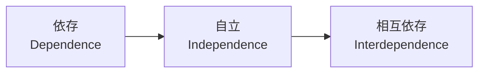
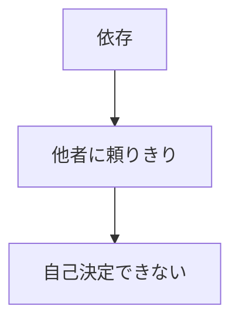
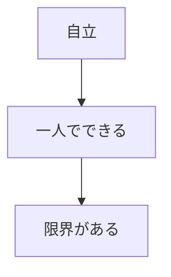
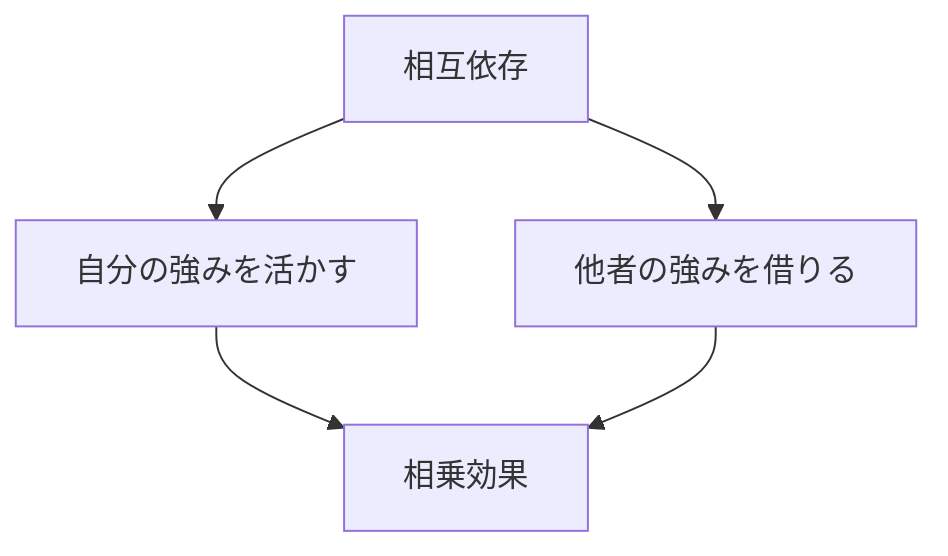

## はじめに

「自分でやらなきゃ...」

「頼るのは弱いこと...」

そう思っていませんか？

でも、本当の強さは、
**一人で全てをやることではありません**。

適切に頼り、
頼られる関係を築く。

それが**相互依存**であり、
最高の自立です。

---

## 3つの段階

### 依存

### 自立

### 相互依存

---

## 実践できること

**① 頼れる人リスト**

何を頼めるか、
明確にする。

**② 頼む練習**

小さなことから
頼んでみる。

**③ 感謝を伝える**

頼んだら、
必ず感謝を。

**④ 自分も頼られる**

他者の役に立つ。

---

## まとめ

頼ることは、
**弱さではなく賢さ**です。

相互依存のネットワークが、
**本当の強さ**です。

一人で抱え込まず、
一緒に成長しましょう。

---

## セッションでできること

コーチングセッションは、
**あなたの相互依存の
パートナー**です。

- 頼ることの練習
- サポートネットワーク設計
- 相互成長

**頼り合いながら、
強くなりましょう。**
