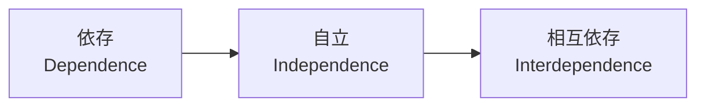
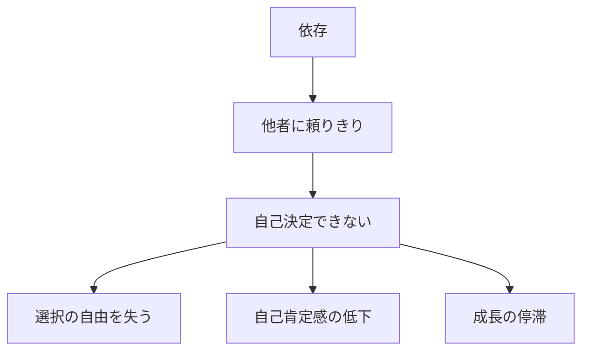
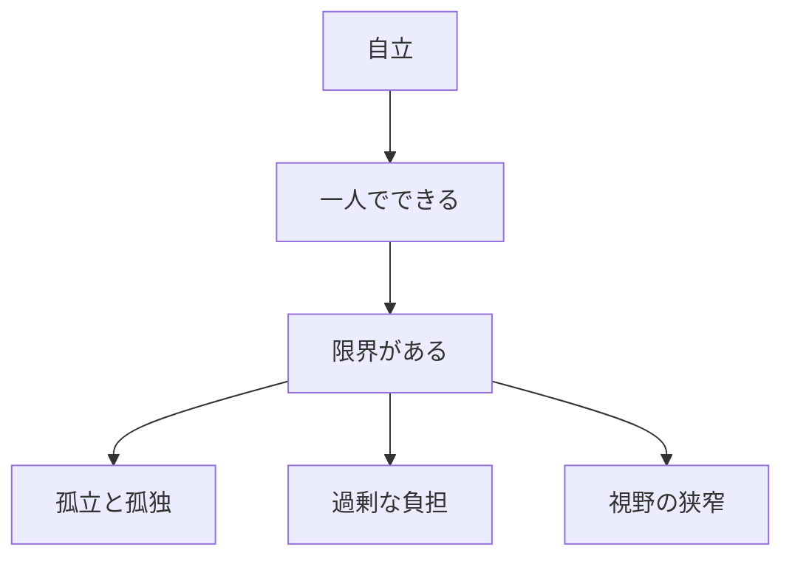
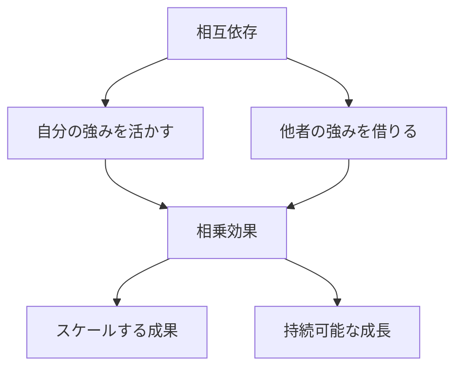

## はじめに

「自分でやらなきゃ...」

「頼るのは弱いこと...」

そう思っていませんか？

でも、本当の強さは、**一人で全てをやることではありません**。適切に頼り、頼られる関係を築く。それが**相互依存**であり、最高の自立です。

私はコーチングの現場で、数えきれないほど「頼ることに罪悪感を感じている」クライアントさんと出会ってきました。みんな本当は優しくて、頼られることは喜べるのに、自分が頼ることだけは何だか「ダメな人」になった気がしてしまうんですよね。

---

## 3つの段階：あなたは今どこにいる？

人間関係の成長には、必ずこの3つのステップがあります。イライト・コーウィーの『7つの習慣』でも有名ですが、実は私たちは無意識のうちにこの流れを辿っています。

---

## 依存がもたらす3つの制限

依存の状態は、決して悪いことではありません。子供時代は親に依存するのが当然ですし、困ったときに誰かを頼るのは人間の本性です。

ただ、「自分で決められない」「誰かの許可がないと動けない」状態が続くと、だんだん自分の軸が曖昧になっていきます。

私のクライアントで、「転職したいんですけど親に反対されて...」と10年間同じ悩みを抱えている方がいました。依存から自立への一歩が、意外と重いんですよね。

---

## 自立の限界：1人で頑張る人が陥る3つの落とし穴

「自立した大人」になったと思ったら、今度は「何でも自分でやらなきゃ」という呪縛にかかりがちです。

ある起業家クライアントさんは、起業当初「経営者は何でも自分でできなきゃ」と思い込み、確定申告もWeb制作も営業も全部一人でやっていました。半年で燃え尽きてしまい、初めて「頼ってもいいんだ」と気づいたそうです。

自立は大事だけど、**「1人でやること」に固執すると必ず限界が来ます**。

---

## 相互依存が生む4つの強み

相互依存とは、**弱い自分を晒すことではなく、得意な部分を徹底的に活かし合うこと**です。

スティーブ・ジョブズとスティーブ・ウォズニアックの関係なんか典型的ですね。ジョブズはビジョンと営業が得意、ウォズニアックは技術が神がかってる。2人が出会って、初めてAppleが生まれた。

「自分にないもの」にコンプレックスを感じる必要はまったくありません。むしろ、「自分にないものを持っている人と組む」ことが、最大の戦略なんです。

---

## 頼る力を高める5つの実践法

### ① 頼れる人リストを作る

「困ったとき誰に相談しよう？」を事前に考えておくんです。

- 仕事の悩み → ○○さん
- 人間関係の悩み → ○○さん  
- お金の相談 → ○○さん

具体的に「この人にはこの悩みを相談しよう」と決めておくと、いざというとき動きやすくなります。

### ② 小さな頼みから練習する

いきなり「人生相談！」はハードル高いですよね。最初は「この資料、確認してもらえますか？」みたいな小さなお願いから始めてみてください。

### ③ 感謝を言葉にする

頼んだら、必ず「ありがとう」を伝える。これが相互依存の潤滑油です。LINEのスタンプでもいいんです。小さな感謝の積み重ねが、信頼関係を深めていきます。

### ④ 自分も頼られる喜びを知る

実は「頼られること」って気持ちいいんですよね。だからこそ、自分が頼ることも、相手に「頼られている喜び」を与えていると思えば、罪悪感が減ります。

### ⑤ 「頼る」ことをスケジュールに入れる

忙しいと「頼む時間」なんてない、と思いがちです。でも、頼むことは投資なんです。週に1回は「誰かに頼む・相談する」時間を意識的に作ってみてください。

---

## まとめ：頼ることは最高の戦略

頼ることは、**弱さではなく賢さ**です。

相互依存のネットワークが、**本当の強さ**です。

「1人で抱え込む」ことを美徳だと思っていた時代は終わりました。今の時代は「誰と組むか」が実力の大きな部分を占めています。

一人で抱え込まず、一緒に成長しましょう。

---

## セッションでできること

コーチングセッションは、**あなたの相互依存のパートナー**です。

- 頼ることの練習（本当は頼りたいのに頼れない癖を外す）
- サポートネットワーク設計（あなたに必要な人間関係の棚卸し）
- 相互成長（あなたの強みを活かし合う関係づくり）

**頼り合いながら、
強くなりましょう。**

[→ 体験セッションの詳細を見る](/sessions)
