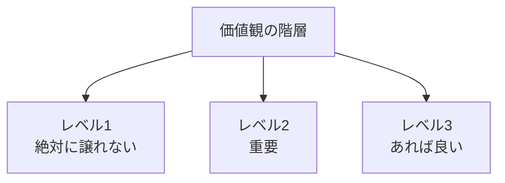
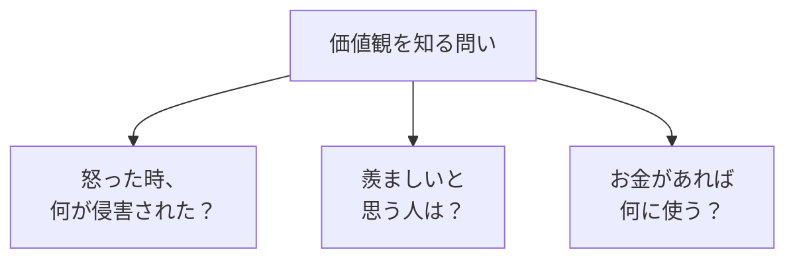

## はじめに

「どっちを選べばいいか
迷う...」

「決めた後に
後悔する...」

迷いが生じるのは、
**価値観が明確でない**からです。

何を最も大切にするか、
**明確にすれば、
迷いは消えます**。

---

## 価値観の階層

---

## 価値観の発見

### 質問

---

## 実践できること

**① 価値観リスト**

10個の価値観を書き、
順位付けする。

**② 決断のフィルター**

迷った時、
「これは私の価値観に
合っているか？」

**③ 定期的な見直し**

半年に1回、
価値観を確認。

---

## まとめ

価値観は、
**人生の羅針盤**です。

明確にすれば、
迷いが消え、
後悔が減ります。

あなたの価値観は
何ですか？

---

## セッションでできること

コーチングセッションでは、
あなたの価値観を
一緒に探索し、
明確化します。

- 価値観の発見
- 優先順位付け
- 意思決定への応用

**あなたの価値観を、
一緒に見つけましょう。**
