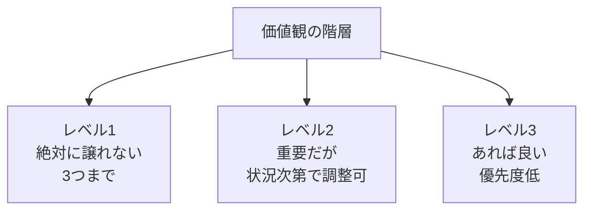
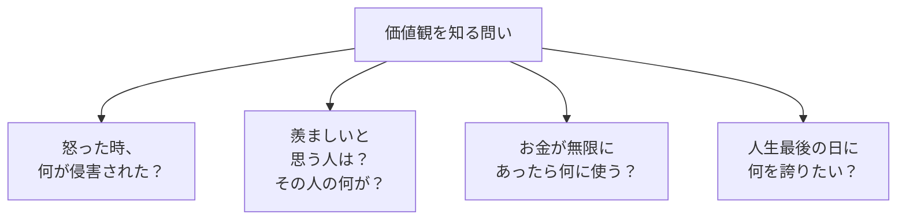

## はじめに

「どっちを選べばいいか
迷う...」

「決めた後に
後悔する...」

迷いが生じるのは、
**価値観が明確でない**からです。

何を最も大切にするか、
**明確にすれば、
迷いは消えます**。

---

## 価値観の階層：あなたの「絶対譲れない基準」はどこにある？

レベル1の価値観は「自分を構成する根幹」です。例えば「家族との時間」がレベル1なら、どんなに魅力的な海外転勤の話が来ても迷いません。逆に「成長」がレベル1なら、安定したけど退屈な仕事を選ぶのは後悔のもとになります。

価値観の衝突が起きるのは、レベル1同士がぶつかった時。でもその時こそ「今の自分にとってどちらがより本質的か」を深く問うことが、本当の自己理解につながります。

---

## 価値観を発見する4つの問い

### 問い① 怒りが教える本音

「あの上司の言い方にムッときた」——その時、侵害されたのは「公正さ」ですか？それとも「尊重」ですか？怒りは価値観の警報装置です。

### 問い② 羨ましさの正体

SNSで誰かを羨ましがった時、本当はその人の「何」を欲しているのでしょうか。「自由な働き方」なのか、「承認されている感覚」なのか。羨ましさの正体が、あなたの価値観です。

### 問い③ お金テスト

「お金があったら何に使う？」という問いは、日常的な制約を取り払って本質を見せてくれます。世界一周？親へのプレゼント？学びの投資？答えが価値観です。

### 問い④ 臨終の視点

人生最後の日に「あの時、ああすべきだった」と後悔するのは何でしょうか。逆に「あれができてよかった」と思うのは何でしょうか。長期的な視点が、本当に大切なものを浮き彫りにします。

---

## 価値観が決断を変える実例

### ケース1：転職の迷いが消えた話

32歳のTさんは「年収アップの外資系企業」と「ワークライフバランスの良い国内企業」で迷っていました。価値観を整理したところ、レベル1は「家族との時間」「精神的な余裕」でした。年収はレベル2。迷いが一気に解消し、国内企業を選びました。1年後、「絶対に正解だった」と言っています。

### ケース2：起業するか迷っていた時

28歳のMさん。安定した会社員生活と、夢だったカフェ開業の間で2年間も迷っていました。価値観ワークをした結果、「挑戦」「自己表現」がレベル1、「安定」は実はレベル2でした。起業して苦労している今も「自分らしく生きている」と充実していると言います。

---

## 価値観を活かす3つの習慣

### 習慣① 価値観リストの作成

まず20個程度の価値観候補（自由、成長、安定、健康、家族、創造、貢献、承認、独立、調和など）を挙げ、トップ5まで絞り込みます。そこからレベル1（絶対譲れない）を3つ選びましょう。

### 習慣② 決断の際の「価値観フィルター」

迷った時はこの3つを問います：
- 「この選択は、私のレベル1価値観を守るか？」
- 「選んだ場合、どの価値観が犠牲になるか？」
- 「その犠牲は受け入れられるか？」

### 習慣③ 半年に1回の価値観見直し

価値観は変わります。20代の「成長」重視も、子育て世代では「家族」重視にシフトするかもしれません。半年に1回、価値観リストを見直し、今の自分と合っているか確認しましょう。

---

## まとめ

価値観は、
**人生の羅針盤**です。

明確にすれば、
迷いが消え、
後悔が減ります。

あなたの価値観は
何ですか？

今日からノートに「私が最も大切にしている3つの価値観」を書き出してみてください。それが、明日の迷いを減らす第一歩になります。

---

## セッションでできること

コーチングセッションでは、
あなたの価値観を
一緒に探索し、
明確化します。

- 価値観の発見
- 優先順位付け
- 意思決定への応用

**あなたの価値観を、
一緒に見つけましょう。**
