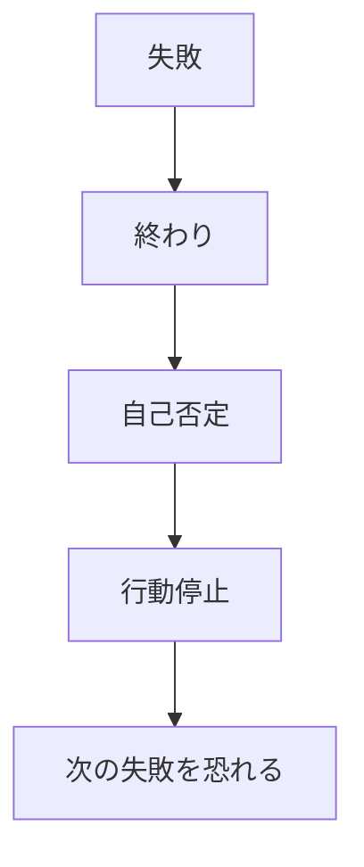
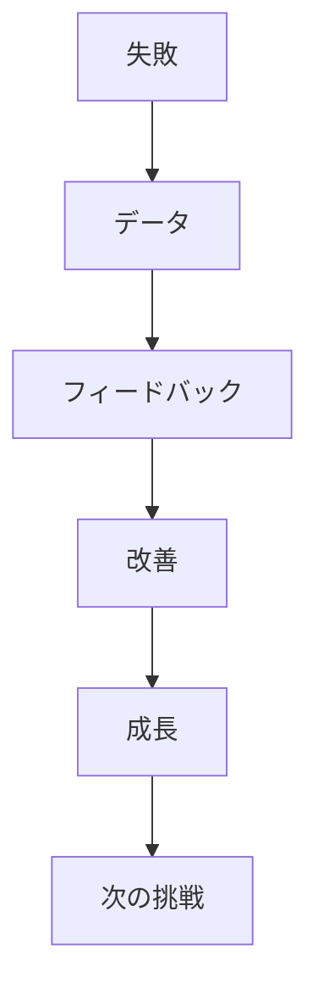
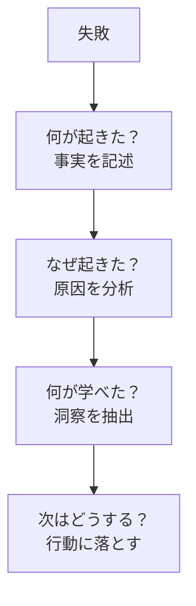

## はじめに

「また失敗した...」

「自分はダメだ...」

失敗は、
**終わりではなく、
データ**です。

失敗の捉え方を変えると、
**成長の加速剤**になります。

---

## 失敗の捉え方を変えると何が変わる？3つのメリット

### 従来の定義：失敗＝終わり

失敗を「自分の価値の欠如」と捉えると、一度の失敗で立ち止まってしまいます。「やっぱり私にはできない」という思い込みが強化され、チャレンジすること自体が怖くなります。

### 新しい定義：失敗＝フィードバック

科学者もアスリートも、失敗を「データ収集」と捉えます。薬の開発で100回失敗したら「100通りの失敗パターンが分かった」と考える。同じ視点を日常に持ち込めば、失敗が恐怖ではなく「情報」に変わります。

### メリット① 挑戦のハードルが下がる

失敗しても「データが増えた」と思えると、始める前の不安が減ります。「完璧を目指す」から「まずやってみる」にシフトします。

### メリット② 回復力（レジリエンス）がつく

失敗から立ち直るスピードが速くなります。1週間落ち込んでいたのが、1日で切り替えられるようになる。それが積み重なり、大きな成果へつながります。

### メリット③ 創造性が解放される

失敗を恐れなければ、型破りなアイデアにも手を出せます。Googleの「20%ルール」も、失敗を許容する文化があってこそ生まれたイノベーションです。

---

## 偉人たちの「失敗観」から学ぶ

### エジソン：発見の連続

「電球の発明に1000回失敗したわけではない。1000通りの電球を作らない方法を発見したのだ」——エジソンの言葉は、失敗の再定義の典型例です。彼にとって「失敗」は存在せず、「学び」しかありませんでした。

### スティーブ・ジョブズ：連続する挫折

アップルを追放され、ネクストも失敗し、ピクサーでも瀬戸際に立たされました。でも彼は「人生のドットは後から繋がる」と言いました。当時は失敗に見えたことも、振り返ればiPhone誕生への準備でした。

### J.K.ローリング：12社からの拒絶

ハリー・ポッターは12の出版社に断られました。13社目でようやく出版できた時、彼女は「失敗からの解放」を経験していました。「失敗によって、本来の自分から解放された」と語っています。

---

## 失敗から学びを引き出す4つの質問

### 質問① 何が起きた？（事実の記述）

「失敗した」ではなく、「プレゼン資料が予定時間の2倍になった」「質問に答えられなかった」など、具体的に書き出します。事実と解釈を分離することが重要です。

### 質問② なぜ起きた？（原因の分析）

「準備不足だった」「優先順位を間違えた」「想定外の質問が来た」など。自分の責任にできる部分と、環境要因に分けて考えます。

### 質問③ 何が学べた？（洞察の抽出）

「練習では実際に声に出して練習する必要がある」「想定質問リストを作るべきだった」など、次に活かせる学びを見つけます。

### 質問④ 次はどうする？（行動への落とし込み）

「次回は3日前から本番想定で練習する」「質問対策シートを作る」など、具体的な行動に変えます。

---

## 失敗を味方につける3つの実践法

### 実践① 「失敗履歴書」を作る

専用のノートやスプレッドシートに、失敗とそこからの学びを記録します。3ヶ月後に振り返ると「こんなに成長していた」と実感できます。失敗を「過去のデータ」として客体化することで、感情から切り離せます。

### 実践② 「挑戦した証」として祝う

小さな失敗も「やってみた」ことの証拠です。1人ランチに行こうと思ったけど結局行けなかった——でも「行こうと思った」こと自体を称賛しましょう。意図が行動に変わる過程は、成功への階段です。

### 実践③ 「失敗の共有」で仲間を作る

信頼できる人に失敗を話すことで、失敗が「自分だけのもの」ではなくなります。「あなたもそうだったんだ」と共感してもらえたり、「私も同じ失敗したよ」と返ってきたり。失敗は普遍的なものであり、恥じるものではないと実感できます。

---

## まとめ

失敗は、
**成功への階段**です。

恐れず、
学びとして受け入れ、
前に進みましょう。

「完璧を目指さず、まずやってみる」——その一歩を踏み出した時、あなたはすでに「失敗を味方につけられる人」へと変わっています。

---

## セッションでできること

コーチングセッションでは、
失敗を再定義し、
成長の糧に変える
サポートをします。

- 失敗の再解釈
- 学びの抽出
- 前進の支援

**失敗を味方につけ、
成長しましょう。**

[→ 体験セッションの詳細を見る](/sessions)
