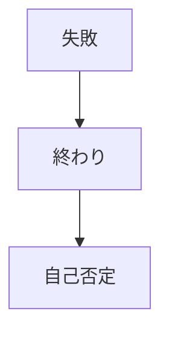
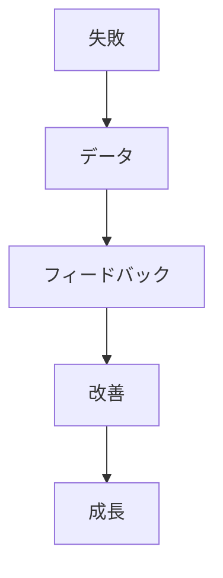
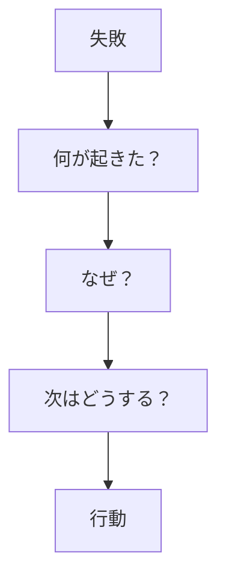

## はじめに

「また失敗した...」

「自分はダメだ...」

失敗は、
**終わりではなく、
データ**です。

失敗の捉え方を変えると、
**成長の加速剤**になります。

---

## 失敗の再定義

### 従来の定義

### 新しい定義

---

## 失敗から学ぶ

---

## 実践できること

**① 「失敗履歴書」**

失敗から学んだことを
記録する。

**② 失敗の祝賀**

小さな失敗を
「挑戦した証」と祝う。

**③ 失敗の共有**

他者に話すことで、
客体化する。

---

## まとめ

失敗は、
**成功への階段**です。

恐れず、
学びとして受け入れ、
前に進みましょう。

---

## セッションでできること

コーチングセッションでは、
失敗を再定義し、
成長の糧に変える
サポートをします。

- 失敗の再解釈
- 学びの抽出
- 前進の支援

**失敗を味方につけ、
成長しましょう。**

[→ 体験セッションの詳細を見る](/sessions)
