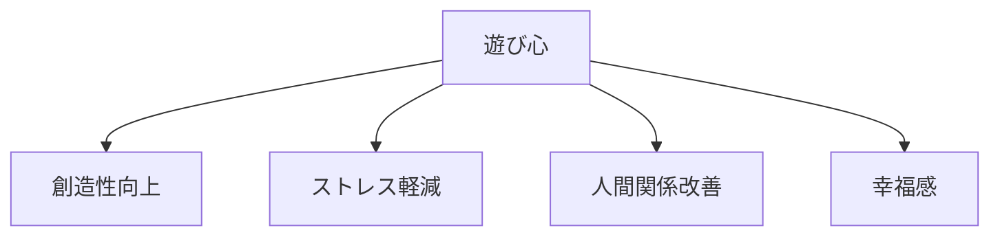
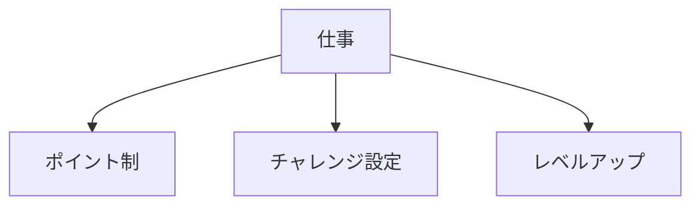
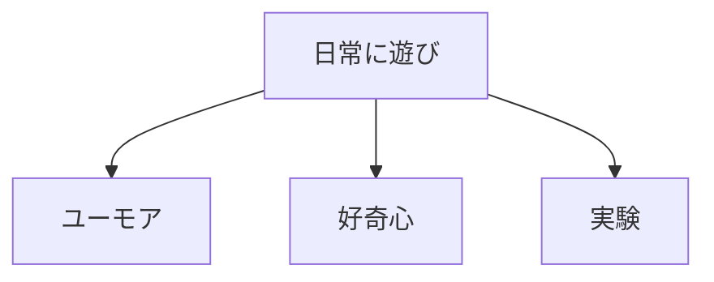

## はじめに

「もっと真面目に...」

「遊んでる場合じゃない...」

真面目さは大切ですが、
**行き過ぎると硬直します**。

遊び心を取り戻すことで、
**創造性と幸福感**が
蘇ります。

---

## 遊び心の効果

---

## 実践方法

### 仕事にゲーム性

### 小さな遊び

---

## 実践できること

**① 「もし？」の問い**

「もしこれがゲームなら？」

**② 小さな挑戦**

新しいやり方を
試してみる。

**③ 笑う**

ユーモアを
意識的に取り入れる。

---

## まとめ

遊び心は、
**甘やかしではありません**。

**創造性と回復力の源**です。

真面目すぎる自分に、
少し余裕を。

---

## セッションでできること

コーチングセッションでは、
遊び心を取り戻す
方法を一緒に探ります。

- 遊び心の発見
- 仕事への応用
- 余裕の創出

**遊び心で、
もっと楽しく、
もっと創造的に。**

[→ 体験セッションの詳細を見る](/sessions)
