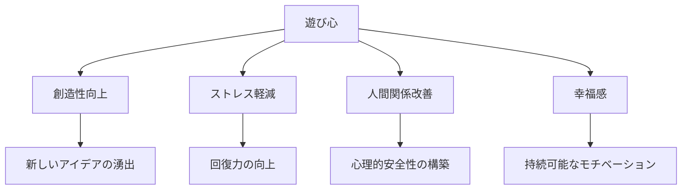
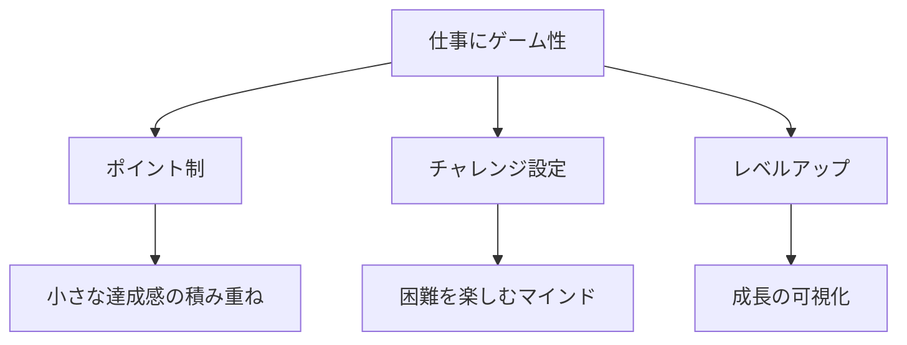
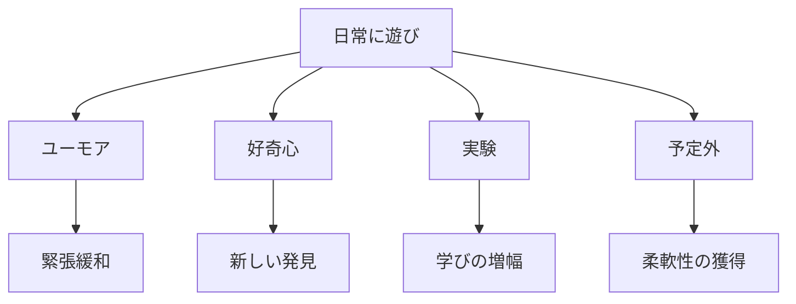

## はじめに

「もっと真面目に...」

「遊んでる場合じゃない...」

真面目さは大切ですが、**行き過ぎると硬直します**。

遊び心を取り戻すことで、**創造性と幸福感**が蘇ります。

私は真面目すぎるクライアントさんをたくさん見てきました。「失敗したらどうしよう」「変なことしたら恥ずかしい」と、自分の可能性を自分で縮めている人が多いんですよね。でも、本当に成果を出している人って、意外と「遊び心」を大切にしているものなんです。

---

## 遊び心がもたらす4つの変化

遊び心は「甘やかし」ではありません。むしろ**最強のパフォーマンスツール**です。

スタンフォード大学の研究でも、遊び心のある状態では脳のデフォルトモードネットワーク（創造性に関わる脳領域）が活性化することが示されています。「ふざけているとき」に最高のアイデアが浮かぶのは、決して偶然じゃないんです。

---

## 仕事にゲーム性を取り入れる3つの方法

### 方法1：自分ルールでポイント制を作る

「メール返信1通 = 10ポイント」「難しい交渉を乗り切ったら100ポイント」みたいに、自分でルールを決めるんです。何気ないタスクが「ゲーム」に変わります。

私のクライアントで、営業職の方が「今日は50ポイント稼ぐぞ！」と決めて、面倒だった電話営業が意外と楽しくなったと言っていました。

### 方法2：毎日小さなチャレンジを設定する

「今日はいつもと違う道で通勤する」「会議で新しい人に話しかける」みたいな、小さな挑戦を1日1つ決めるんです。期待外れでもOK。挑戦したこと自体がポイントです。

### 方法3：レベルアップ感覚で成長を捉える

「今の自分はLv.25」みたいに思ってみてください。大きな目標を「次のレベルアップ条件」だと考えると、遠い目標もゲーム感覚で楽しめます。

---

## 日常に遊びを取り戻す4つの習慣

### 習慣1：ユーモアを意識的に取り入れる

笑うことは最強のリセットボタンです。仕事中でも、思い出したミームやお気に入りのコメディ動画を3分見るだけで、頭の切り替えができます。

ある経営者クライアントさんは、厳しい会議の前に必ず「好きな漫才の動画を3分見る」ルールを作ったそうです。緊張しすぎないことで、柔軟な交渉ができるようになったと言っていました。

### 習慣2：「もし？」の問いを毎日1回

「もしこの仕事がゲームなら？」「もし自分が子供だったら？」「もし100年後の人間が見たら？」

視点を変える問いは、固まった思考を溶かしてくれます。毎日1回、意識的に「もし？」を問いてみてください。

### 習慣3：小さな実験をする

「これ、こうやったらどうなるかな？」という好奇心を大切に。新しいツールを試すでもいいし、違うカフェで仕事するでもいい。小さな実験が、新しい発見への扉を開きます。

### 習慣4：予定外を楽しむ

予定が狂ったとき、「ああ、めんどくさい」と思いがちですよね。でも「予定外」は「遊びのチャンス」でもあるんです。予定が空いた30分、普段やらないことをやってみる。そんな余裕が、創造性を育てます。

---

## 「遊び心なし」が招く3つのリスク

真面目すぎるあまり遊び心を失うと...

1. **思考の硬直化** - 「これが正解」という固定観念に縛られる
2. **ストレスの蓄積** - リラックスする機会が減り、慢性的な緊張状態に
3. **人間関係の希薄化** - 堅苦しい空気が、本音のコミュニケーションを阻害する

遊び心は、**パフォーマンスを持続させるための必須スキル**なんです。

---

## まとめ：遊び心は最強の武器

遊び心は、**甘やかしではありません**。

**創造性と回復力の源**です。

真面目すぎる自分に、少し余裕を。

「今、楽しめているか？」という問いを、自分に投げかけてみてください。楽しんでいるとき、あなたは最高のパフォーマンスを発揮できます。

---

## セッションでできること

コーチングセッションでは、遊び心を取り戻す方法を一緒に探ります。

- 遊び心の発見（あなたが無意識に持っている「遊び」の才能を見つける）
- 仕事への応用（真面目な仕事に、どう遊び心を取り入れるか）
- 余裕の創出（遊び心を育むための心の余裕を作る）

遊び心で、もっと楽しく、もっと創造的に。
