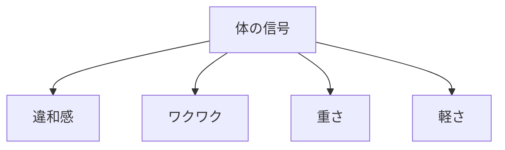
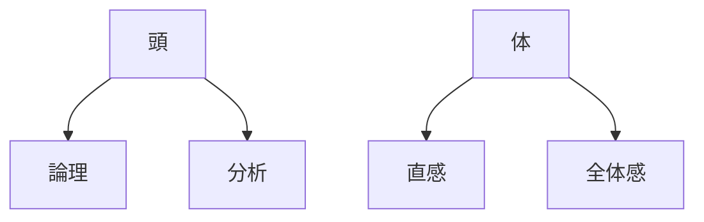
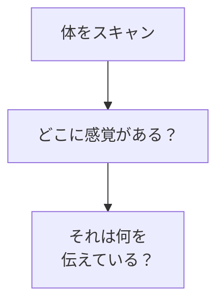
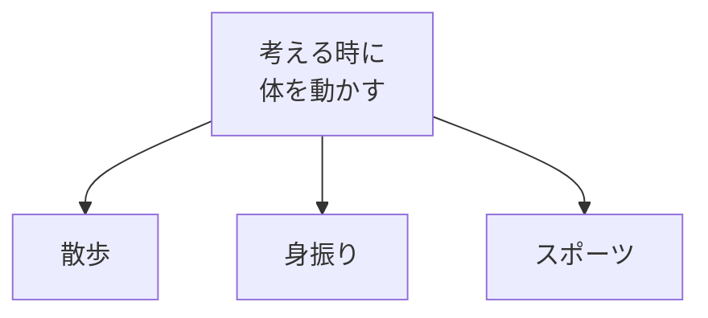

## はじめに

「頭ではわかるんだけど...」

「なぜか違和感がある...」

体は、
**頭脳以上の知恵**を
持っています。

エンボディメントは、
**体の知恵を取り入れる**こと。

---

## 身体の知恵

### 体の信号

### 頭 vs 体

---

## 実践方法

### 身体スキャン

### 動きの活用

---

## 実践できること

**① 決断前の身体チェック**

「この選択をした時、
体はどう感じる？」

**② 身体スキャン**

1日1回、
体の感覚をチェック。

**③ 動きながら考える**

散歩しながら
悩みを整理。

---

## まとめ

体は、
**知恵の宝庫**です。

頭だけでなく、
体も味方につけて、
より豊かに生きましょう。

---

## セッションでできること

コーチングセッションでは、
身体の知恵を
取り入れる練習を
一緒にします。

- 身体スキャン
- 体の信号の解読
- エンボディメントの習慣化

**体の知恵を、
一緒に育てましょう。**
