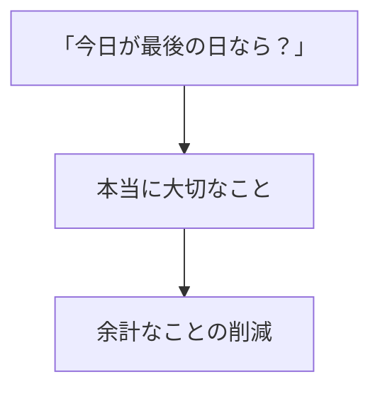
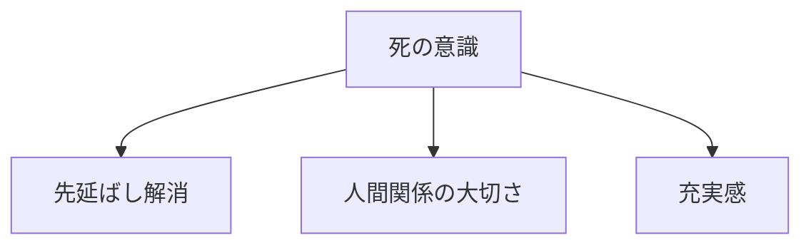
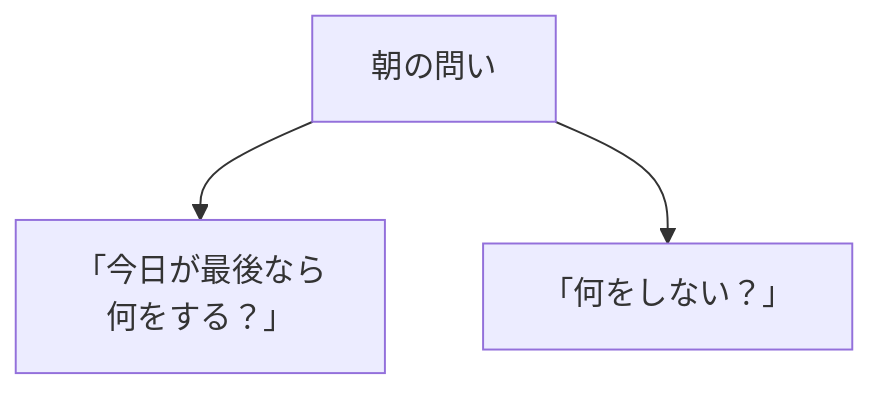
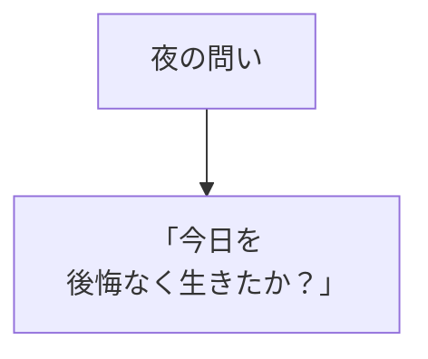

## はじめに

「いつかやろう...」

「まだ時間がある...」

でも、本当に
時間はありますか？

「死」を意識することで、
**生が鮮明**になります。

これが
**メメント・モリ**
（死を記憶せよ）です。

---

## メメント・モリの効果

### 優先順位の明確化

### 行動の変化

---

## 実践方法

### 毎日の問い

### 振り返り

---

## 実践できること

**① 毎朝の問い**

「今日が最後の日なら？」

**② 週次レビュー**

「この週をどう生きたい？」

**③ 年に1回**

「もし1年で死ぬとしたら？」

---

## まとめ

死を意識することは、
**暗いことではありません**。

**生を輝かせる**ことです。

有限だからこそ、
今を大切に。

---

## セッションでできること

コーチングセッションでは、
メメント・モリを
活用した人生設計を
一緒に行います。

- 優先順位の明確化
- 後悔のない生き方
- 充実感の創出

**死を意識し、
生を輝かせましょう。**

[→ 体験セッションの詳細を見る](/sessions)
