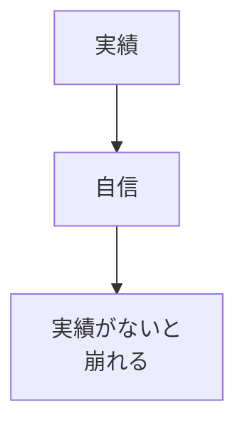
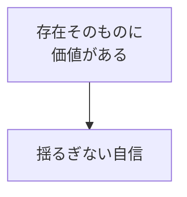
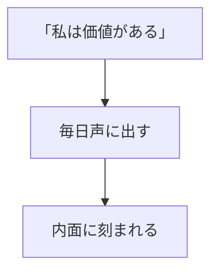
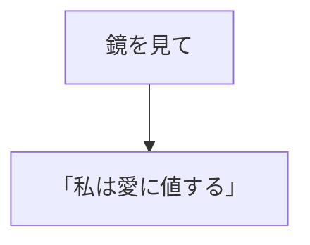

## はじめに

「実績がないと
自信が持てない...」

「評価されないと
価値を感じない...」

でも、本当の自信は、
**外から来るものではありません**。

**内側から湧き出るもの**です。

自己肯定感の土台を作り、
根拠のない自信を
持ちましょう。

---

## 条件付き vs 無条件

### 条件付き自信

### 無条件の自信

---

## 土台を作る

### 自己対話

### 自己肯定の練習

---

## 実践できること

**① アファメーション**

毎朝、自己肯定を
声に出す。

**② 自己批判にSTOP**

「でも」が出たら、
「だから」と変える。

**③ 小さな成功を祝う**

存在すること自体を
祝う。

---

## まとめ

自己肯定感は、
**与えられるものではなく、
自分で育てるもの**です。

根拠のない自信を持ち、
揺るぎない土台を。

---

## セッションでできること

コーチングセッションでは、
あなたの自己肯定感の
土台を一緒に築きます。

- 自己肯定の練習
- 内面の対話
- 土台の強化

**揺るぎない自信を、
一緒に作りましょう。**
