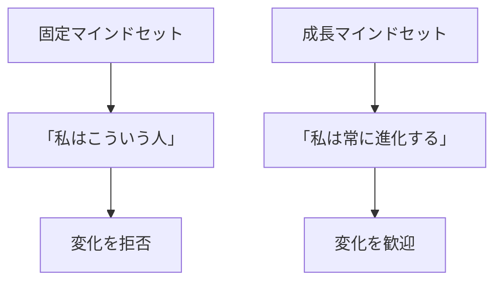
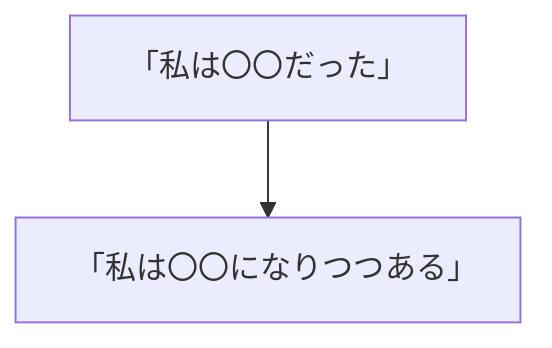
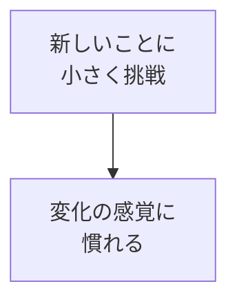

## はじめに

「昔の自分を
手放せない...」

「変わるのは怖い...」

でも、変化は
**避けられません**。

変化に適応するのではなく、
**変化を楽しむ**。

それが、
生き残るためのメンタルです。

---

## 適応のメンタル

### 固定 vs 成長

---

## 実践方法

### アイデンティティの柔軟性

### 小さな実験

---

## 実践できること

**① 「だった自分」を手放す**

「私は〇〇だった」→
「私は〇〇もできる」

**② 月に1つ新しいこと**

小さな変化を
習慣化。

**③ 失敗を「実験」と呼ぶ**

「失敗」ではなく、
「学びの実験」。

---

## まとめ

変化は、
**脅威ではなく機会**です。

古い自分を脱ぎ捨て、
新しく生まれ変わる。

それが、
進化の喜びです。

---

## セッションでできること

コーチングセッションでは、
変化への適応を
サポートします。

- アイデンティティの再定義
- 変化への抵抗の克服
- 進化の設計

**変化を楽しみ、
進化しましょう。**
