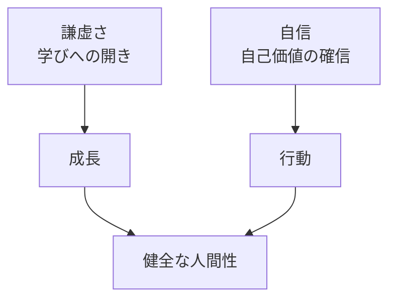
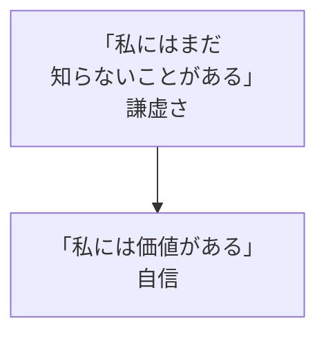
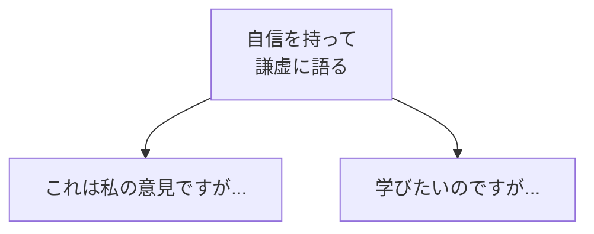

## はじめに

「自信を持つと
傲慢に見られる...」

「謙虚だと
弱く見られる...」

謙虚さと自信は、
**両立できます**。

謙虚さは
**学びへの姿勢**。

自信は
**自己価値の確信**。

---

## 謙虚さと自信の関係

---

## 実践方法

### 「知る」と「できる」を分ける

### 表現の仕方

---

## 実践できること

**① 「知らない」を恐れない**

知らないことは
学びの機会。

**② 「できる」を認める**

自分の強みを
謙虚に語る。

**③ フィードバックを受ける**

自信を持ちながら
改善する。

---

## まとめ

謙虚さと自信は、
**相反するものではありません**。

学び続け、
自分の価値を信じる。

それが、
魅力的な人間性です。

---

## セッションでできること

コーチングセッションでは、
謙虚さと自信の
バランスを見つけます。

- 自信の構築
- 謙虚さの実践
- 表現の工夫

**謙虚に、
自信を持ちましょう。**
