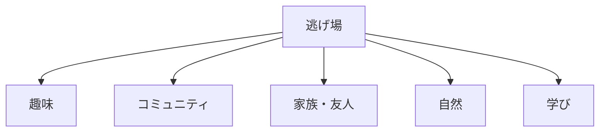
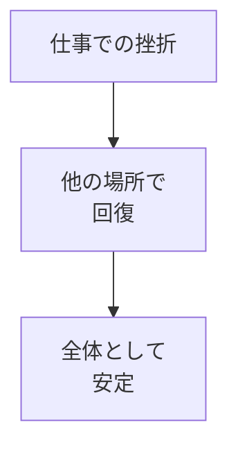
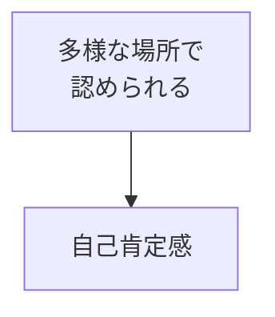

## はじめに

「仕事が全て...」

「ここで認められないと
自分に価値がない...」

一つの場所に
全てを賭けると、
**そこで挫折した時、
全てを失います**。

「逃げ場」を複数持つことで、
**メンタルの安定**が
保てます。

---

## 逃げ場の種類

---

## 効果

### 分散化

### 多面的な自己肯定

---

## 実践できること

**① 仕事以外のアイデンティティ**

「私は〇〇な人」
を複数持つ。

**② 週に1回「逃げ場」時間**

仕事を忘れられる
時間を作る。

**③ コミュニティに所属**

仕事以外の
つながりを持つ。

---

## まとめ

逃げ場は、
**逃げるためではなく、
回復するため**です。

複数の場所で
自分を肯定し、
メンタルを安定させましょう。

---

## セッションでできること

コーチングセッションでは、
あなたの「逃げ場」を
一緒に設計します。

- 逃げ場の発見
- 多様なアイデンティティ構築
- メンタル安定化

**逃げ場を持ち、
安心して生きましょう。**

[→ 体験セッションの詳細を見る](/sessions)
