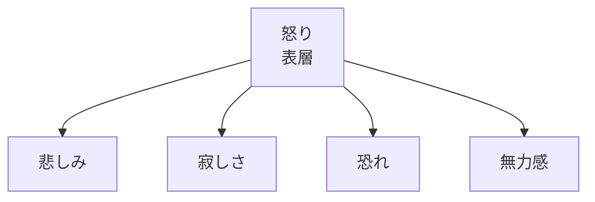
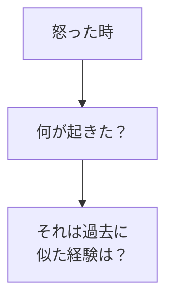
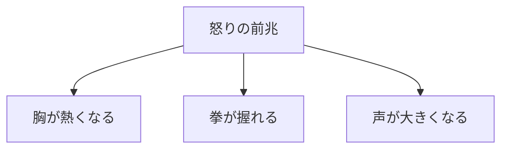
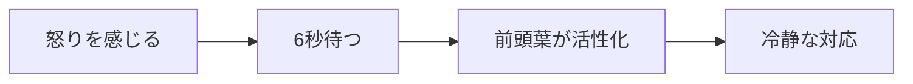
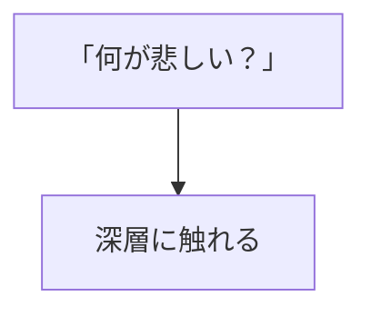

## はじめに

「また怒ってしまった...」

「なぜこんなに
イライラするんだろう...」

怒りは、
**表層の感情**です。

その下には、
**悲しみや寂しさ、
恐れ**が隠れています。

怒りのパターンを分析し、
適切に管理しましょう。

---

## 怒りの構造

### 氷山モデル

---

## パターン分析

### トリガーの特定

### 身体的サイン

---

## クールダウンの仕組み

### 6秒ルール

### 深層感情への問い

---

## 実践できること

**① 怒り日記**

何に怒ったか、
深層の感情は何か。

**② 身体のチェック**

怒りの前兆に
気づく。

**③ 6秒の習慣**

反応する前に
必ず待つ。

---

## まとめ

怒りは、
**他の感情の仮面**です。

深層に触れ、
適切に管理することで、
より健全な対応ができます。

---

## セッションでできること

コーチングセッションでは、
怒りのパターンを分析し、
クールダウンの仕組みを
作ります。

- パターン分析
- トリガーの特定
- 管理方法の習得

**怒りを理解し、
管理しましょう。**
