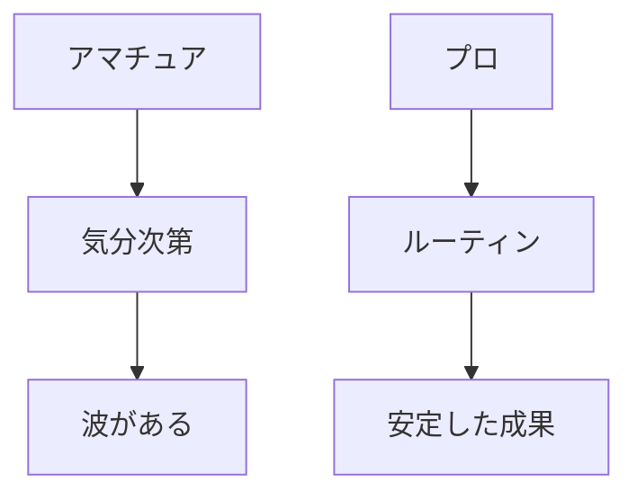
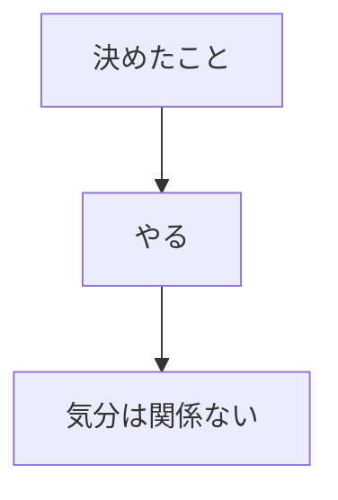
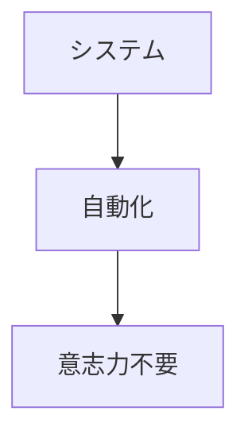

## はじめに

「今日はやる気が出ない...」

「気分が乗らないから
明日にしよう...」

でも、プロは
**気分に左右されません**。

決めたことを、
**淡々とやり抜く**。

それが、
プロフェッショナルの
メンタルです。

---

## アマチュア vs プロ

---

## プロのメンタル

### 規律

### システム

---

## 実践できること

**① ルーティンを固定**

毎日同じ時間に
同じことをする。

**② 「気分」ではなく「システム」**

「やる気が出たら」ではなく、
「決めた時間に」。

**③ 小さく始める**

無理のない範囲で
継続する。

---

## まとめ

プロのメンタルは、
**「やる気」を待たない**こと。

システムと規律で、
安定した成果を。

それが、
信頼の源です。

---

## セッションでできること

コーチングセッションでは、
プロのメンタルを
身につけるサポートをします。

- ルーティン設計
- システム構築
- 規律の習慣化

**プロのメンタルで、
成果を出し続けましょう。**
