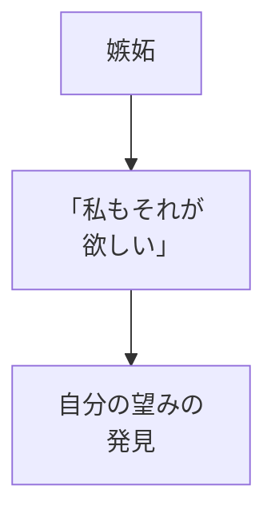
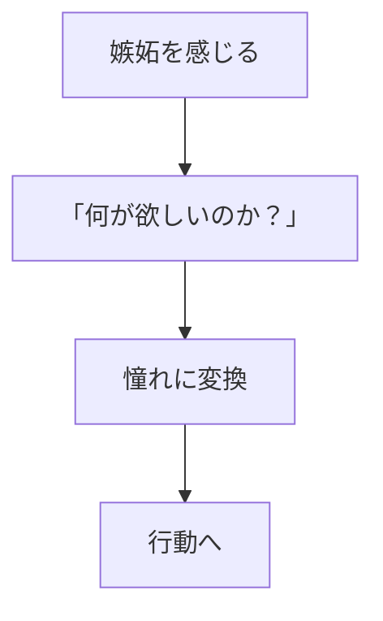

## はじめに

「あの人が羨ましい...」

「なんであの人ばかり...」

嫉妬は、
**自然な感情**です。

でも、そのままでは
**毒**になります。

嫉妬を「憧れ」に変え、
**成長のエネルギー**に
しましょう。

---

## 嫉妬の正体

### 望みの鏡

---

## 変換のプロセス

---

## 実践できること

**① 嫉妬を書き出す**

誰を嫉妬したか、
何が欲しいか。

**② ロールモデル化**

嫉妬の対象を
目標に変える。

**③ 自分の道を探す**

同じものを
自分なりに。

---

## まとめ

嫉妬は、
**望みのサイン**です。

それを憧れに変え、
成長の糧に。

---

## セッションでできること

コーチングセッションでは、
嫉妬を分析し、
憧れへの変換を
サポートします。

- 嫉妬の分析
- 望みの発見
- 行動への接続

**嫉妬を力に変え、
成長しましょう。**
