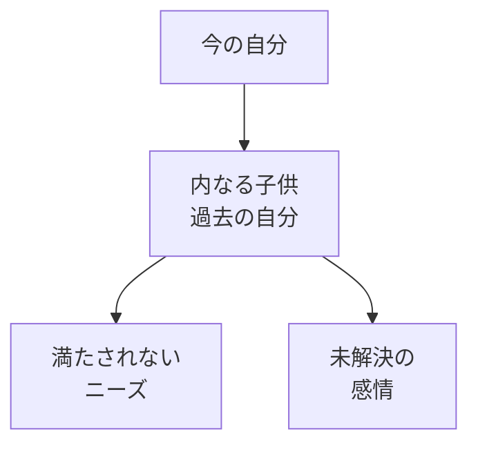
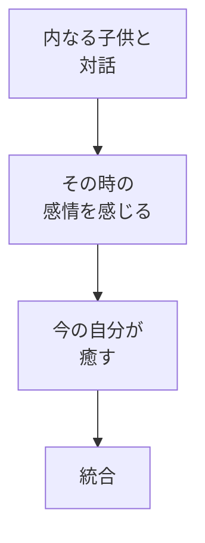

## はじめに

「なぜか同じパターンを
繰り返す...」

「子供の頃のことが
引きずっている...」

私たちの中には、
**「内なる子供」**が
います。

その子供が
傷ついていると、
今の私たちも
苦しみます。

その子供を癒すことで、
今の自分も癒されます。

---

## インナーチャイルドとは

---

## 癒しのプロセス

---

## 実践できること

**① 幼少期の写真を見る**

その子に何が
必要だったか。

**② 手紙を書く**

今の自分から
過去の自分へ。

**③ セルフコンパッション**

「あなたは愛されている」

---

## まとめ

内なる子供を癒すことは、
**今の自分を癒すこと**です。

過去の傷に
気づき、愛を注ぎましょう。

---

## セッションでできること

コーチングセッションでは、
インナーチャイルドワークを
安全に進めます。

- 内なる子供との対話
- 癒しのプロセス
- 統合の支援

**内なる子供を癒し、
今の自分を自由に。**
