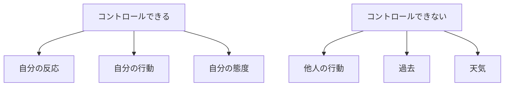
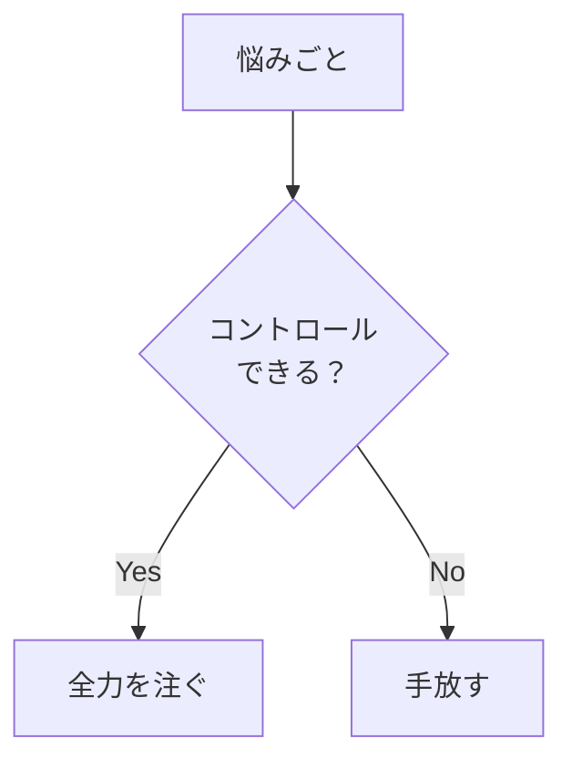

## はじめに

「あの人が変われば...」

「状況が良ければ...」

変えられないものに
エネルギーを使うと、
**疲れ果てるだけ**です。

コントロールできることに
集中し、
それ以外は**手放す**。

それが、
ストイックな生き方です。

---

## コントロールの範囲

---

## 実践方法

### 二分法

---

## 実践できること

**① 悩みを分類**

コントロールできるか
判断する。

**② エネルギーの配分**

変えられることに
集中。

**③ 「それは私の課題か？」**

他人の問題を
引き受けていないか。

---

## まとめ

コントロールできることに
集中し、
それ以外は手放す。

それが、
エネルギーを節約し、
充実感を生む道です。

---

## セッションでできること

コーチングセッションでは、
コントロールの範囲を
明確にし、
手放す練習をします。

- コントロール分析
- エネルギー配分
- 手放しの実践

**コントロールを極め、
手放しも極めましょう。**

[→ 体験セッションの詳細を見る](/sessions)
