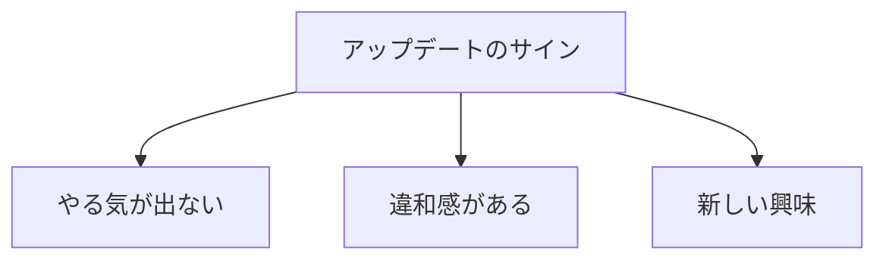

## はじめに

「昔の夢を
諦められない...」

「昔の自分が
決めた道を...」

でも、あなたは
**成長しました**。

昔の目的が、
今のあなたに
合わないのは
当然です。

目的は、
**何度でもアップデート**していい。

---

## 目的の進化

---

## アップデートのタイミング

---

## 実践できること

**① 年に1回見直す**

「今の目的は？」

**② 小さく実験**

新しい方向性を
試す。

**③ 過去の自分に感謝**

その時の目的が
今の自分を作った。

---

## まとめ

目的は、
**生きた証**です。

成長に合わせて
アップデートし、
常に新鮮な動機を。

---

## セッションでできること

コーチングセッションでは、
今のあなたに合った
目的を一緒に探ります。

- 現在の目的分析
- 新しい目的の発見
- アップデートの設計

**目的をアップデートし、
新しい一歩を。**

[→ 体験セッションの詳細を見る](/sessions)
