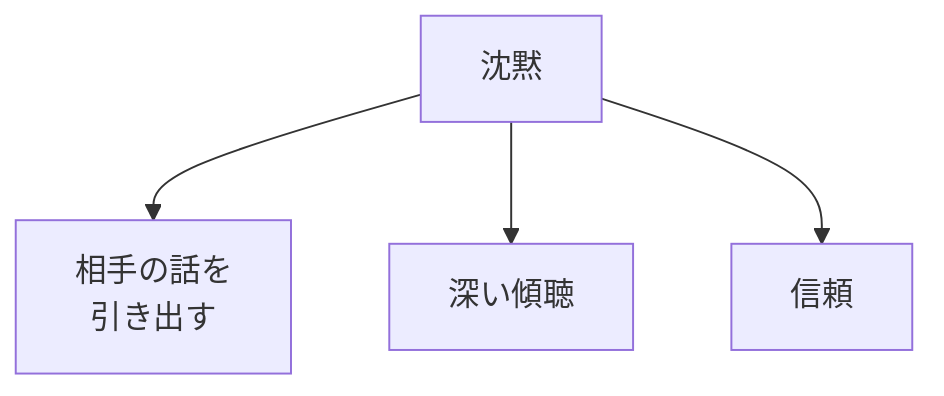
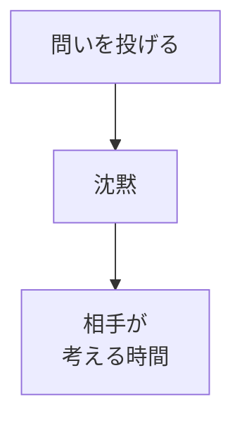
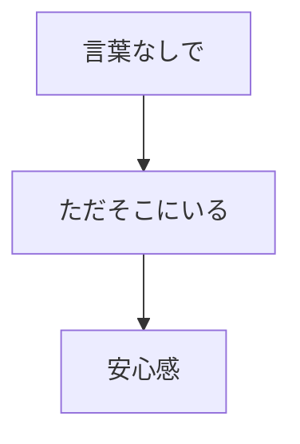

## はじめに

「何か話さなきゃ...」

「沈黙が気まずい...」

でも、時に
**沈黙は言葉より
力強い**です。

ただそこにいること、
それが
**深い信頼**を生みます。

---

## 沈黙の力

### 効果

---

## 実践方法

### 相手のペース

### 存在の質

---

## 実践できること

**① 3秒待つ**

相手が話し終わったら、
3秒待つ。

**② 沈黙を恐れない**

気まずさを
受け入れる。

**③ 存在に集中**

ただ、
そこにいる。

---

## まとめ

沈黙は、
**言葉のないコミュニケーション**です。

存在の質で、
深い信頼を築きましょう。

---

## セッションでできること

コーチングセッションでは、
沈黙の力を活かした
深い対話を
提供します。

- 沈黙の練習
- 存在の質向上
- 深い傾聴

**沈黙で、
深く繋がりましょう。**

[→ 体験セッションの詳細を見る](/sessions)
