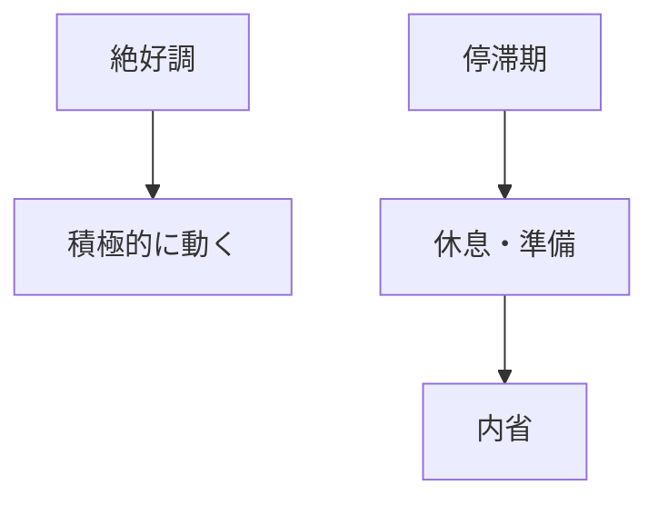

## はじめに

「また調子が悪い...」

「なぜかやる気が出ない...」

でも、これは
**自然なサイクル**です。

絶好調が続くことは
ありません。

**バイオリズムを受け入れ、
停滞期を静かに過ごす**。

それが、
長期的な成功の秘訣です。

---

## バイオリズムのサイクル

---

## 各期間の過ごし方

---

## 実践できること

**① サイクルを記録**

エネルギーの波を
把握する。

**② 停滞期の受容**

「今は休息の時」と
捉える。

**③ 無理をしない**

無理やり動かず、
回復を待つ。

---

## まとめ

バイオリズムは、
**自然の摂理**です。

受け入れ、
適切に対応することで、
長期的に輝けます。

---

## セッションでできること

コーチングセッションでは、
あなたのバイオリズムを
分析し、
最適な過ごし方を
設計します。

- バイオリズム分析
- 各期間の戦略
- 長期的パフォーマンス設計

**バイオリズムを味方に、
長く輝きましょう。**
