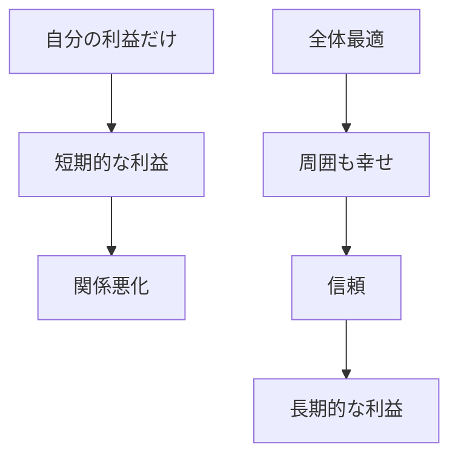
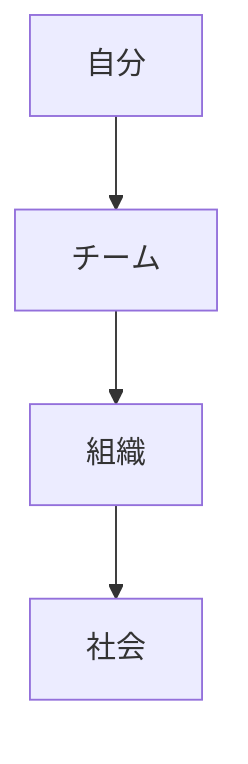
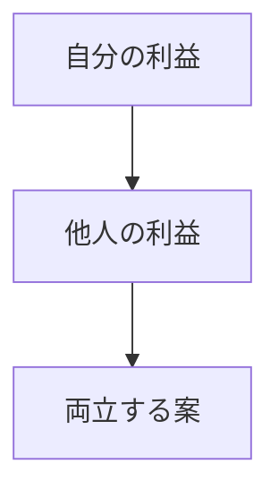

## はじめに

「自分の利益を
最優先しなきゃ...」

でも、本当に
それが幸せですか？

実は、
**他人のために動くことで、
自分も幸せになる**。

これが
**全体最適**のメンタルです。

---

## 全体最適のメカニズム

---

## 実践方法

### 視点の拡大

### Win-Winを探す

---

## 実践できること

**① 「誰かの役に立つか？」**

決断の基準に加える。

**② 感謝の循環**

与え、
与えられる。

**③ 社会貢献**

小さなことから
始める。

---

## まとめ

全体最適は、
**損ではなく得**です。

周囲を幸せにすることで、
自分も幸せになる。

それが、
豊かな人生の秘密です。

---

## セッションでできること

コーチングセッションでは、
全体最適の視点を
育てます。

- 視点の拡大
- Win-Winの設計
- 社会貢献の実践

**全体を幸せにし、
自分も幸せに。**

[→ 体験セッションの詳細を見る](/sessions)
