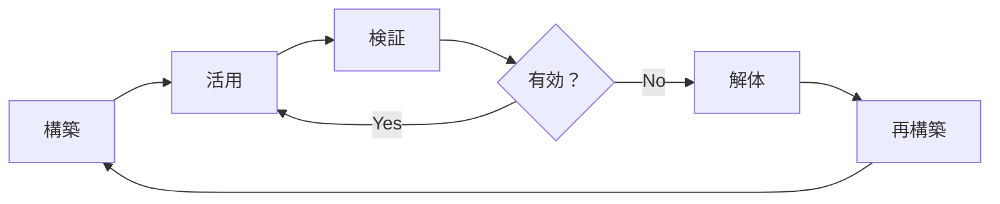
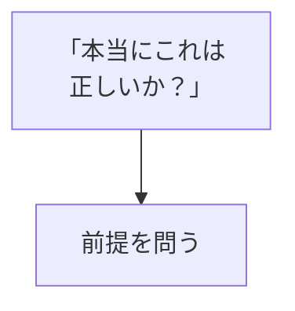
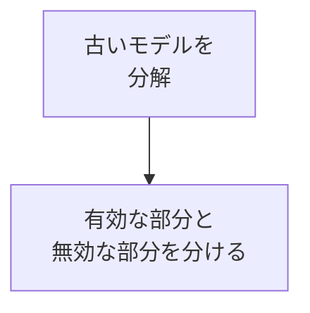
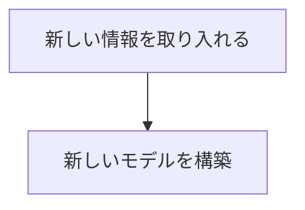

## はじめに

「これが正しい」

「私はこう考える」

でも、その「考え」は、
**本当に今のあなたに
合っていますか？**

メンタルモデルは、
**一度作ったら終わりではなく、
常にアップデート**するもの。

解体し、
再構築することで、
**進化し続ける**のです。

---

## メンタルモデルの寿命

---

## 解体と再構築のプロセス

### 1. 疑う

### 2. 解体

### 3. 再構築

---

## 実践できること

**① 年に1回「モデルレビュー」**

自分の考え方を
棚卸しする。

**② 異なる視点を取り入れる**

自分と違う考え方に
触れる。

**③ 「もし違っていたら？」**

常に疑問を持つ。

---

## まとめ

メンタルモデルは、
**生きたもの**です。

定期的に解体し、
再構築することで、
常に進化し続ける。

それが、
成長の本質です。

---

## セッションでできること

コーチングセッションでは、
あなたのメンタルモデルを
一緒に見直し、
アップデートします。

- 現在のモデル分析
- 解体の支援
- 再構築のサポート

**メンタルモデルを進化させ、
新しい自分になりましょう。**
