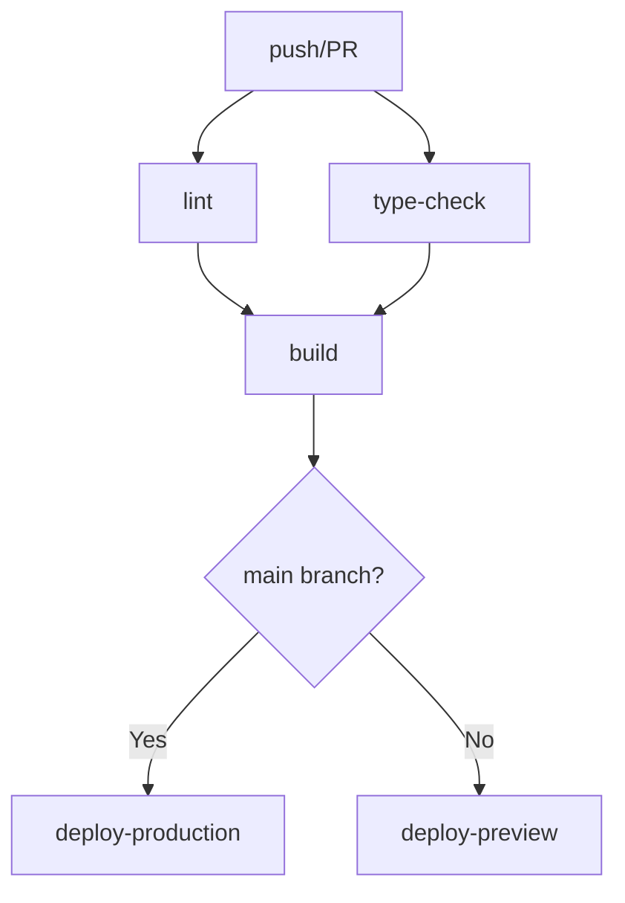

# CI/CD Setup Documentation

**作成日**: 2026-01-25
**関連Issue**: #72

---

## 概要

Portfolio SiteのCI/CDパイプラインをGitHub Actionsで実装しました。

---

## ワークフロー構成

### GitHub Actions Workflow: `.github/workflows/ci-cd.yml`

**トリガー条件**:
- `push` to `main`, `develop`, `feature/**`, `fix/**` ブランチ
- `pull_request` to `main`, `develop` ブランチ

### ジョブ構成

| ジョブ名 | 目的 | 条件 |
|---------|------|------|
| `lint` | ESLintによるコード品質チェック | 常に実行 |
| `type-check` | TypeScriptによる型チェック | 常に実行 |
| `build` | Next.jsアプリケーションのビルド | lint, type-check成功後 |
| `deploy-preview` | プレビューデプロイ (Vercel) | PR時 |
| `deploy-production` | 本番デプロイ (Vercel) | mainブランチへのpush時 |

---

## 依存関係



---

## 必要なGitHub Secrets

以下のシークレットをGitHubリポジトリに設定する必要があります：

| Secret名 | 説明 | 必須 |
|----------|------|------|
| `VERCEL_TOKEN` | Vercelのデプロイトークン | はい |
| `NEXT_PUBLIC_GOOGLE_FORMS_URL` | Google FormsのAction URL（オプション） | いいえ |

### Secretの設定方法

1. GitHubリポジトリの **Settings** → **Secrets and variables** → **Actions**
2. **New repository secret**をクリック
3. Secret名と値を入力
4. **Add secret**をクリック

---

## デプロイの種類

### プレビューデプロイ (Pull Request)

- **トリガー**: `main`または`develop`ブランチへのPR作成・更新時
- **デプロイ先**: Vercel Preview環境
- **URL形式**: `https://preview-{pr-number}.vercel.app`
- **コメント**: PRにプレビューURLを自動コメント

### 本番デプロイ (Production)

- **トリガー**: `main`ブランチへのpush時
- **デプロイ先**: Vercel Production環境
- **URL**: `https://takahiro-motoyama.vercel.app`

---

## ビルド環境

- **OS**: `ubuntu-latest`
- **Node.js**: `20.x`
- **依存関係のインストール**: `npm ci`
- **キャッシュ**: `npm`キャッシュを使用（高速化）

---

## 品質チェック

### Linting (ESLint)

```bash
npm run lint
```

### Type Checking (TypeScript)

```bash
npx tsc --noEmit
```

### Build Verification

```bash
npm run build
```

---

## 既存のワークフロー

### `daily-rebuild.yml`

- **目的**: 毎日の定時本番デプロイ
- **スケジュール**: JST 00:00 (UTC 15:00)
- **手動実行**: 可能

このワークフローは残し、CI/CDとは別に稼働させます。

---

## トラブルシューティング

### ビルド失敗時

1. GitHub Actionsのログを確認
2. どのジョブで失敗したかを特定
3. エラーメッセージを確認
4. ローカルで再現

### デプロイ失敗時

1. `VERCEL_TOKEN`が正しく設定されているか確認
2. Vercelのプロジェクト設定を確認
3. Vercelのダッシュボードでデプロイログを確認

### タイムアウト

ビルドやデプロイがタイムアウトする場合：
1. 依存関係のキャッシュが効いているか確認
2. `npm ci`が正常に完了しているか確認
3. ビルド時間が長すぎないか確認

---

## ベストプラクティス

### ブランチ戦略

- `main`: 本番コード（デプロイ対象）
- `develop`: 開発中のコード
- `feature/*`: 新機能の開発
- `fix/*`: バグ修正

### コミット規約

```
feat: 新機能の追加
fix: バグ修正
docs: ドキュメントの変更
style: フォーマット変更
refactor: リファクタリング
perf: パフォーマンス改善
test: テストの追加・修正
chore: その他の変更
```

### PRの作成

1. `main`または`develop`ブランチへPRを作成
2. プレビューデプロイが自動で実行される
3. プレビューURLで動作確認
4. レビュー後にマージ
5. `main`ブランチへのマージで本番デプロイ

---

## 関連リソース

- [GitHub Actions Documentation](https://docs.github.com/en/actions)
- [Vercel Documentation](https://vercel.com/docs)
- [GitHub Secret管理](https://docs.github.com/en/actions/security-guides/encrypted-secrets)

---

## 次のステップ

1. GitHub Secretsの設定
   - `VERCEL_TOKEN`の登録
2. CI/CDワークフローのテスト
   - PRを作成してプレビューデプロイを確認
   - mainブランチにマージして本番デプロイを確認
3. 既存の`daily-rebuild.yml`の必要性を検討

---

**最終更新**: 2026-01-25
